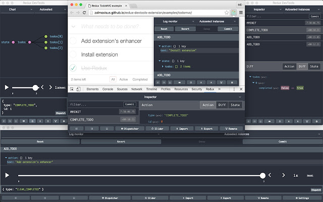

# Google Chrome

Для установки Google Chrome на компьютер необходимо перейти на этот [сайт](https://www.google.com/intl/ru_ru/chrome/)

Google Chrome — браузер, разрабатываемый компанией Google на основе свободного браузера Chromium и движка Blink.

Google Chrome направлен на повышение безопасности, скорости и стабильности. А 9 июня 2009 года разработчики Google Chrome в своём интервью для неофициального сообщества пользователей обозначили стратегию дальнейшего развития своего продукта, которая заключается в том, что браузер будет иметь максимально высокую скорость работы и минимально допустимую функциональность, а все дополнительные функции планируется внедрять при помощи расширений.

  

## Расширении для Google Chrome

### React Developer Tools

Для установки React Developer Tools на компьютер необходимо перейти на этот [сайт](https://chrome.google.com/webstore/detail/react-developer-tools/fmkadmapgofadopljbjfkapdkoienihi/related?hl=ru).

Allows to inspect the React component hierarchies in the Chrome Developer Tools.

You will get two new tabs in your Chrome DevTools: "⚛️ Components" and "⚛️ Profiler".
The Components tab shows you the root React components that were rendered on the page, as well as the subcomponents that they ended up rendering.

By selecting one of the components in the tree, you can inspect and edit its current props and state in the panel on the right. In the breadcrumbs you can inspect the selected component, the component that created it, the component that created that one, and so on.

If you inspect a React element on the page using the regular Elements tab, then switch over to the React tab, that element will be automatically selected in the React tree.
The Profiler tab allows you to record performance information.
This extension requires permissions to access the page's React tree, but it does not transmit any data remotely.

  

### Redux DevTools

Для установки Redux DevTools на компьютер необходимо перейти на этот [сайт](https://chrome.google.com/webstore/detail/react-developer-tools/fmkadmapgofadopljbjfkapdkoienihi/related?hl=ru).

Redux DevTools for debugging application's state changes.
The extension provides power-ups for your Redux development workflow. Apart from Redux, it can be used with any other architectures which handle the state.

  

### Apollo Client Developer Tools

Для установки Apollo Client Developer Tools на компьютер необходимо перейти на этот [сайт](https://chrome.google.com/webstore/detail/apollo-client-developer-t/jdkknkkbebbapilgoeccciglkfbmbnfm).

GraphQL debugging tools for Apollo Client in the Chrome developer console.
Apollo Client Developer Tools is a Chrome DevTools extension for the open-source JavaScript GraphQL client, Apollo Client. The extension has 3 main features:

1. A built-in GraphiQL console that allows you to make queries against your GraphQL server using your app's network interface directly (no configuration necessary).

2. A query watcher that shows you which queries are being watched by the current page, when those queries are loading, and what variables those queries are using.

3. A mutation inspector that displays the mutations made to you apollo-client app data.

4. A cache inspector that displays your client-side Redux store in an Apollo-Client-friendly way. You can explore the state of the store through a tree-like interface, and search through the store for specific field keys and values.

  

### Wappalyzer

Для установки Wappalyzer на компьютер необходимо перейти на этот [сайт](https://chrome.google.com/webstore/detail/wappalyzer/gppongmhjkpfnbhagpmjfkannfbllamg?hl=ru).

Identify web technologies
Wappalyzer is a browser extension that uncovers the technologies used on websites. It detects content management systems, eCommerce platforms, web servers, JavaScript frameworks, analytics tools and many more.

  

### Postman Interceptor

Для установки Postman Interceptor на компьютер необходимо перейти на этот [сайт](https://chrome.google.com/webstore/detail/postman-interceptor/aicmkgpgakddgnaphhhpliifpcfhicfo?hl=ru).

Postman Interceptor helps you send requests which use browser cookies through the Postman app.
It can also send headers which are normally restricted by Chrome but are critical for testing APIs. The Interceptor makes this process painless. Something that would have required a proxy earlier can now be achieved without any installation steps or extra configuration.

  

