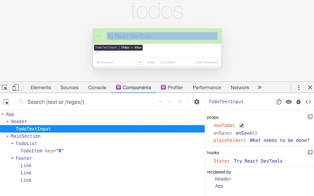
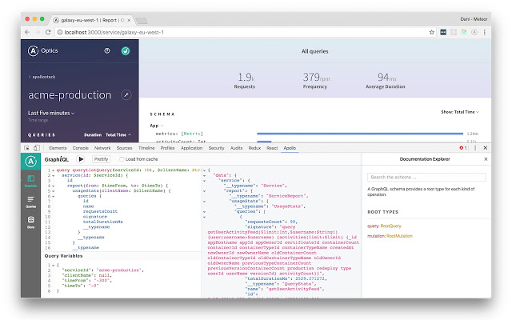
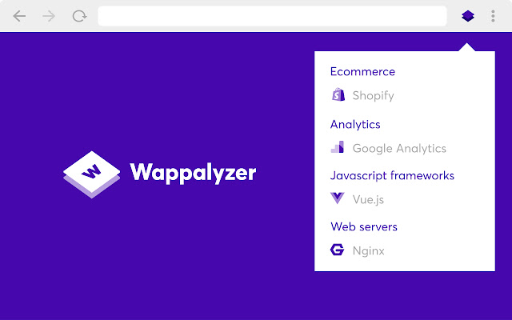

# Mozilla FireFox

Для установки Mozilla FireFox на компьютер необходимо перейти на этот [сайт](https://www.mozilla.org/ru/firefox/new/)

Mozilla Firefox — свободный браузер на движке Gecko, разработкой и распространением которого занимается Mozilla Corporation. Второй по популярности браузер в мире и первый среди свободного ПО.

Вместо того, чтобы предоставить все возможности в стандартной поставке, Firefox предоставляет механизм расширений, позволяющий пользователям модифицировать браузер в соответствии с их требованиями.

Почти с начала своего существования Firefox является достаточно гибким браузером с широкими возможностями настройки: пользователь может устанавливать дополнительные темы, изменяющие внешний вид программы, плагины и расширения, добавляющие новую функциональность.

Эта расширяемость достигается, в основном, за счёт использования в интерфейсе разработанного исключительно для Gecko языка разметки XUL и используемых в Web JavaScript и CSS, что иногда приводит к более медленной работе интерфейса и повышенным требованиям к оперативной памяти, чем у браузеров, больше полагающихся на функции оконной среды. Для тех, кому нужны функции движка Gecko, а не расширяемый интерфейс, существуют сторонние браузеры, в которых интерфейс реализован по-другому; например, Camino, Epiphany и Kazehakase.

  

## Расширении для Mozilla FireFox

### React Developer Tools

Для установки React Developer Tools на компьютер необходимо перейти на этот [сайт](https://addons.mozilla.org/en-US/firefox/addon/react-devtools/).

Allows to inspect the React component hierarchies in the Chrome Developer Tools.

You will get two new tabs in your Chrome DevTools: "⚛️ Components" and "⚛️ Profiler".
The Components tab shows you the root React components that were rendered on the page, as well as the subcomponents that they ended up rendering.

By selecting one of the components in the tree, you can inspect and edit its current props and state in the panel on the right. In the breadcrumbs you can inspect the selected component, the component that created it, the component that created that one, and so on.

If you inspect a React element on the page using the regular Elements tab, then switch over to the React tab, that element will be automatically selected in the React tree.
The Profiler tab allows you to record performance information.
This extension requires permissions to access the page's React tree, but it does not transmit any data remotely.

  

### Redux DevTools

Для установки Redux DevTools на компьютер необходимо перейти на этот [сайт](https://addons.mozilla.org/ru/firefox/addon/reduxdevtools/).

Redux DevTools for debugging application's state changes.
The extension provides power-ups for your Redux development workflow. Apart from Redux, it can be used with any other architectures which handle the state.

  

### Apollo Client Developer Tools

Для установки Apollo Client Developer Tools на компьютер необходимо перейти на этот [сайт](https://addons.mozilla.org/en-US/firefox/addon/apollo-developer-tools/).

GraphQL debugging tools for Apollo Client in the Chrome developer console.
Apollo Client Developer Tools is a Chrome DevTools extension for the open-source JavaScript GraphQL client, Apollo Client. The extension has 3 main features:

1. A built-in GraphiQL console that allows you to make queries against your GraphQL server using your app's network interface directly (no configuration necessary).

2. A query watcher that shows you which queries are being watched by the current page, when those queries are loading, and what variables those queries are using.

3. A mutation inspector that displays the mutations made to you apollo-client app data.

4. A cache inspector that displays your client-side Redux store in an Apollo-Client-friendly way. You can explore the state of the store through a tree-like interface, and search through the store for specific field keys and values.

  

### Wappalyzer

Для установки Wappalyzer на компьютер необходимо перейти на этот [сайт](https://addons.mozilla.org/ru/firefox/addon/wappalyzer/).

Identify web technologies
Wappalyzer is a browser extension that uncovers the technologies used on websites. It detects content management systems, eCommerce platforms, web servers, JavaScript frameworks, analytics tools and many more.

  

### Interceptor

Для установки Interceptor на компьютер необходимо перейти на этот [сайт](https://addons.mozilla.org/ru/firefox/addon/xhr-interceptor/).

Run web clients without backends by mocking HTTP requests

During development, often times front-end devs have to wait for the back-end devs to offer an API to work on. Even after the API is given, if the front-end team wants a different set of data to work on, they again need to wait for the changes to be made and hosted. We, front-end developers resort to techniques like storing the data in a variable or using mock API’s.

To overcome this, we are working on a browser extension Interceptor, which lets you define your own response, and everytime the browser requests data from a particular URL, returns you with mock data instead of, from the server.

  

