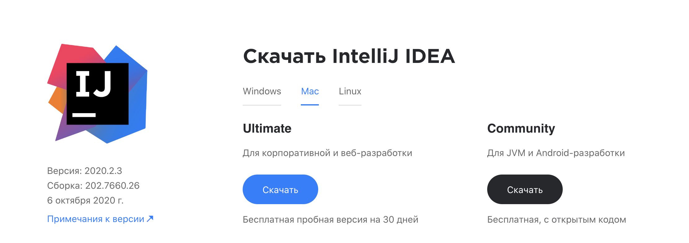
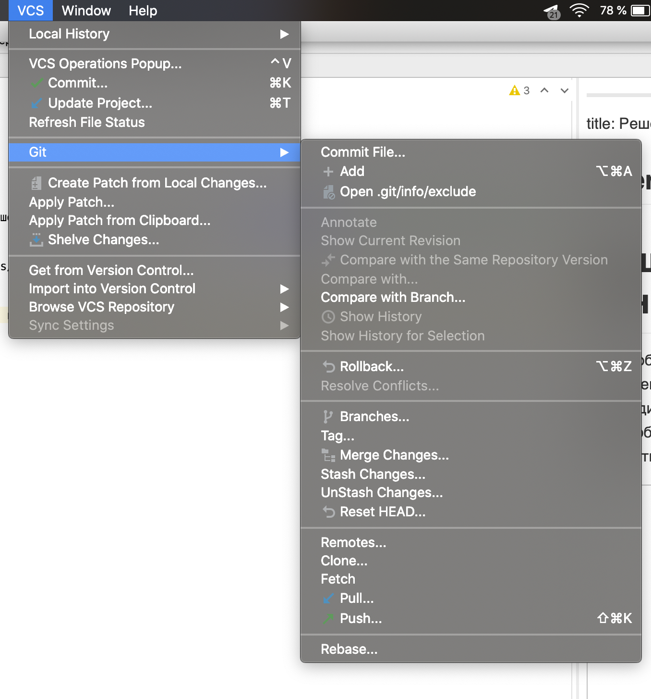
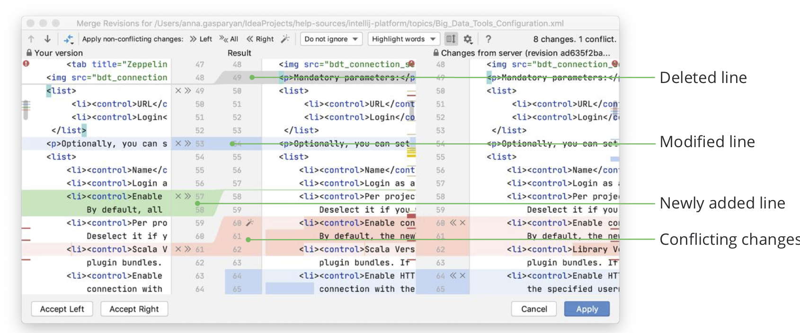

# Решение конфликтов

Для удобного и интерактивного разрешения конфликтов необходимо скачать [IntelliJ IDEA](https://www.jetbrains.com/ru-ru/idea/download/#section=mac) (или любой продукт Jet Brains если есть доступ).

 

Если в момент rebase у вас возникли конфликты, необходимо заупстить проект в IntelliJ IDEA, в меню сверху открыть **VCS -> Git -> Resolve conflicts**

 

Далее откроется интерактивное окно для разрешения конфликта. Необходимо внимательно выбрать правильные изменения.

**ВАЖНО:** При разрешении конфликтов будьте внимательны, чтобы не удалить изменения ваших коллег, если сомневаетесь пригласите человека, кому принадлежать данные изменения и уточните, какие из изменений актуальны на данный момент

 

