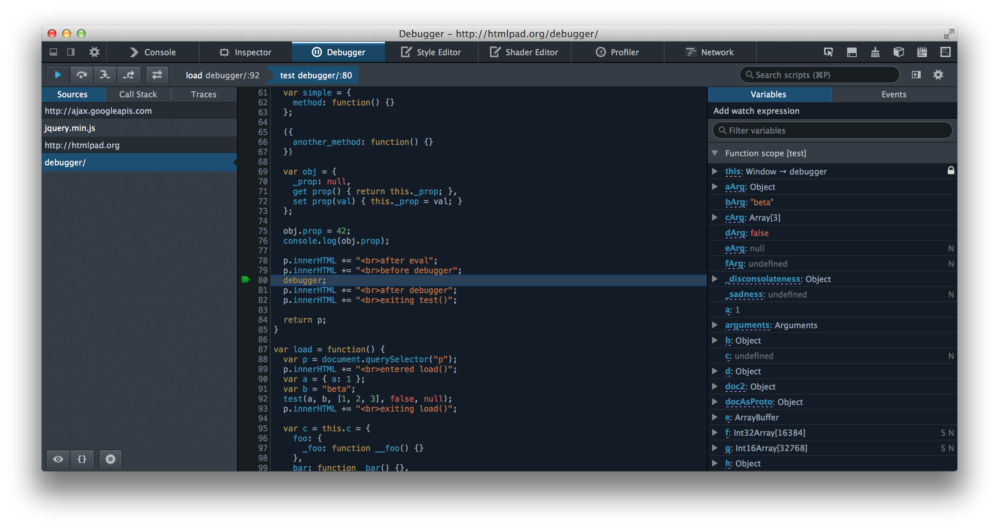

## debugger

Выражение debugger открывает доступ к любому доступному в конкретном окружении отладочному функционалу, например к установке точек останова (т.н. брейкпоинтов). Если функционал отладки в среде выполнения недоступен, данное выражение не будет иметь никакого эффекта.

### Синтаксис

> debugger;

### Пример

Следующий пример показывает код, содержащий выражение debugger. Это позволяет вызвать функционал отладки (если таковой может быть использован) при вызове функции.

```js
function potentiallyBuggyCode() {
	debugger;
	// чтобы протестировать работу отладчика, поместите здесь код, заведомо содержащий ошибку
}
```

При вызове отладчика выполнение скрипта приостановится в том месте, где находится выражение debugger, что равноценно
действию установленных в скрипте точек останова.

<p align="center">
  
</p>

### Поддержка настольных браузеров

|    Возможность    | Chrome | Firefox(Gecko) | Internet Explorer | Opera | Safari |
| :---------------: | :----: | :------------: | :---------------: | :---: | :----: |
| Базовая поддержка |  (Да)  |      (Да)      |       (Да)        | (Да)  |  (Да)  |

### Поддержка мобильных браузеров

|    Возможность    | Android | Chrome for Android | Firefox Mobile(Gecko) | IE Mobile | Safari Mobile |
| :---------------: | :-----: | :----------------: | :-------------------: | :-------: | :-----------: |
| Базовая поддержка |  (Да)   |        (Да)        |         (Да)          |   (Да)    |     (Да)      |
