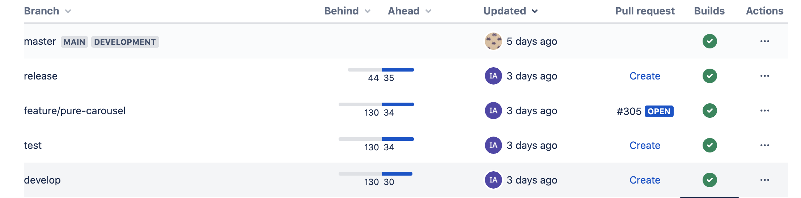
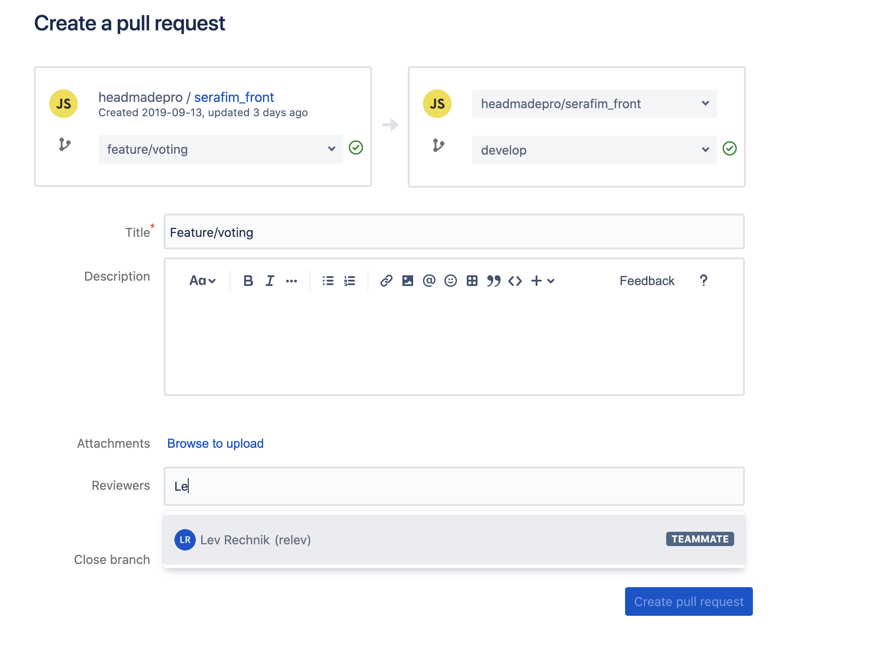

# Работа с репозиторием

У задачи обязательно должно быть описание и тест-кейсы. Без данных пунктов, задачу в работу не брать.

Если задача общая для бэкэнда и фронта, первый берёт тот на чьей стороне стоит описание сначала, после выполнения переводит на нужную сторону.

## Инструкция по созданию и работе

1.  Задача переводится на исполнителя в статусе новая;
2.  Исполнитель меняет статус на в работе;
    -   В зависимости от типа задачи создать новую ветку `git checkout -b название-ветки` от ветки `develop` (пример: если тип задачи улучшение или разработка, новая ветка будет называтся `feature/task-number` или `feature/task-name`, если тип задачи ошибка, новая ветка будет называтся `bugfix/task-number` или `bugfix/task-name`);
    -   Добавить в индекс все изменения `git add -A` или `git add .`, добавить конкретный файл `git add filename.ext`, закомитить изменения `git commit -m "#888 feat: <commit message>"` (где `#8888` - номер задачи).
    -   Запушить изменений в удаленный репозиторий `git push origin feature/name`
3.  После выполнения создаётся **Pull request**

    -   В bitbucket выбрать нужный проект, слева в меню нажать на **Branches**
    -   Выбрать нужную ветку и в столбце **Pull request** -> **create** в ветку **develop**

    - Добавить **Reviewers**

    - Нажать **Create pull request**

4.  Перевести задачу в **Need review** процент выполнения **30%**
5.  При добавлении комментариев от проверяющих, необходимо исправить, закоммитить новые изменения и запушить, pull request обновится автоматически.
6.  После ревью задача переводится в Ждёт тестирования процент выполнения **70%**
7.  После выполнения тест-кейсов, выполнить **rebase** от актуального **develop** `git pull --rebase origin develop`
8.  Далее выполнить **merge** в актуальный **develop** `git checkout develop` --> `git merge <feature-name> --no-ff`
9.  Запушить ветку **develop** (ни в коем случае не пушить ветку **develop** с ключом --force)
10. Чтобы отправить изменения текущей ветки на test, нужно выполнить команду `make push.test` (ветка может быть любая), далее дождаться билда и задеплоить на тест.
11. Выгрузить изменения на прод:
    -   Сделать ребейз своей ветки от актуального develop: git pull --rebase origin develop
    -   Сделать бэкап дева, например: git checkout -b develop-bck (название бэкапа любое)
    -   Выполнить мёрдж своей ветки в develop: git checkout develop, git merge своя-ветка --no-ff
    -   Залить последний develop в origin git push origin develop
    -   Обновить release: git checkout release, git pull --rebase origin release (если нужно, сделать бэкап наподобие develop)
    -   Выполнить мёрдж release в master: git checkout master, git pull, git merge release --no-ff (актуальный release в актуальный master), git push origin master
    -   Смерджить develop в release, git merge develop --no-ff, если в release были hotfix, выполнить preserve-merges в develop от release. git checkout develop, git rebase release -r
    -   Залить release в origin: git push origin release
12. После деплоя на тестовый сервер ветки **release** задача переводится в **тестирование** и процент выполнения **90%**;
13. После деплоя на прод, повторяются тест-кейсы, задача переводится в статус **решена** и **100%**

## Передача задачи в случае невыполнения

1.  Перевести задачу на нужного исполнителя;
2.  Описать в комментарии в чём затык;
3.  Оставить ссылку на Pull Request (если есть);
4.  Оставить название ветки.
