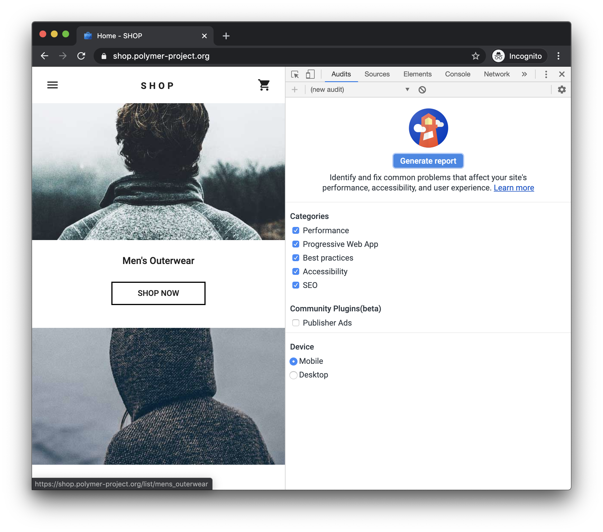
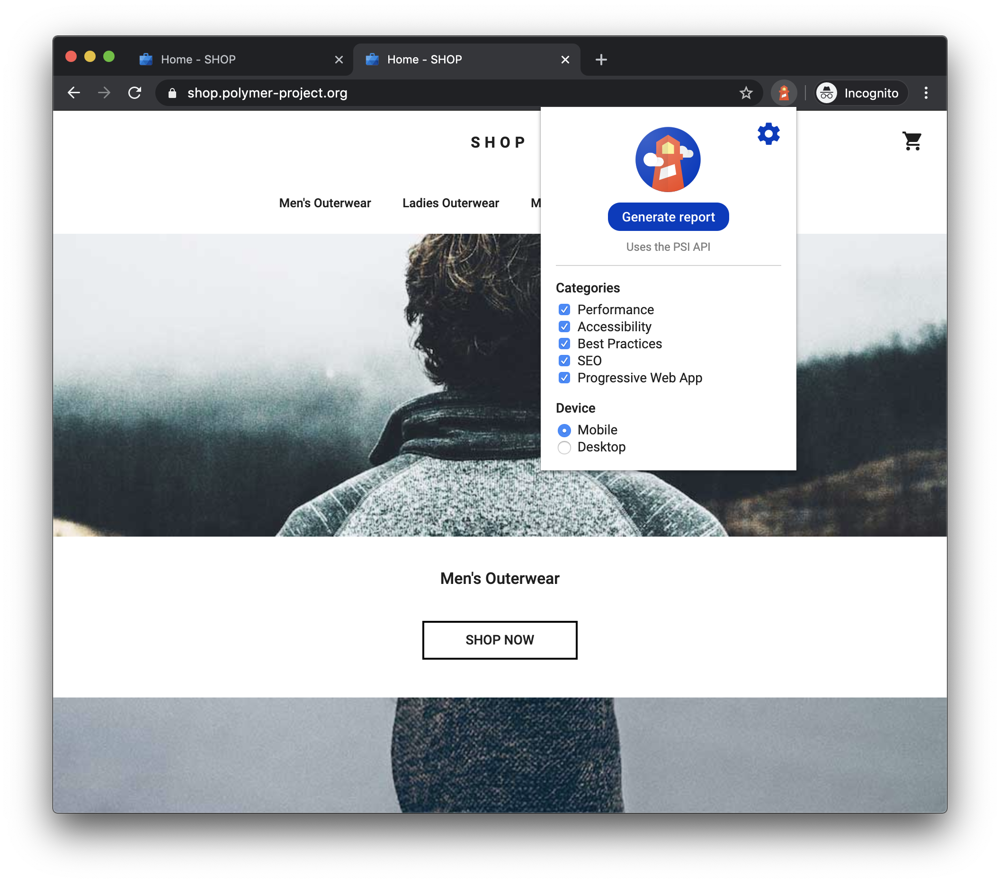
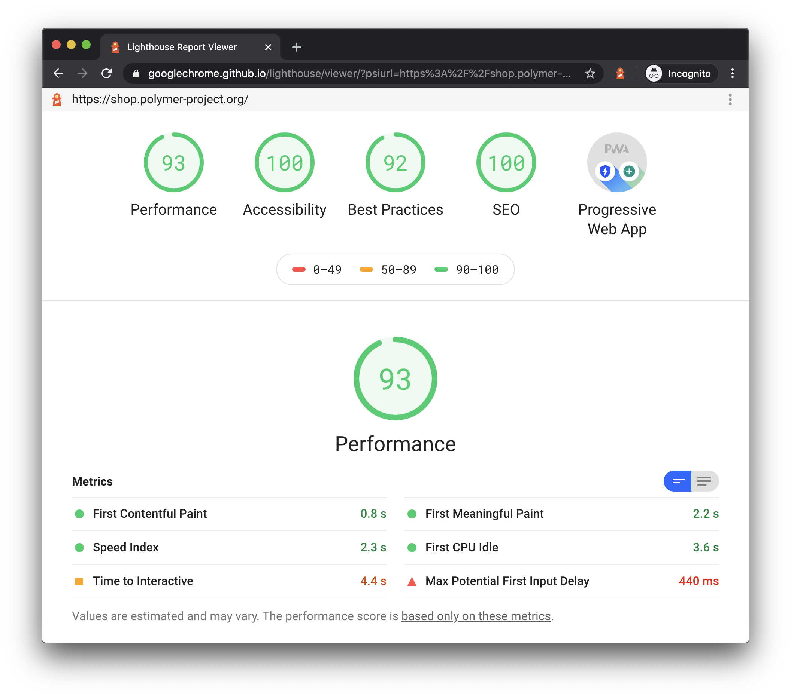
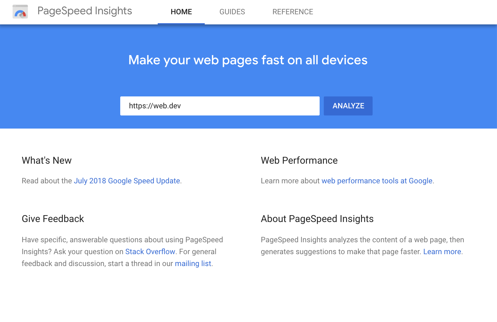
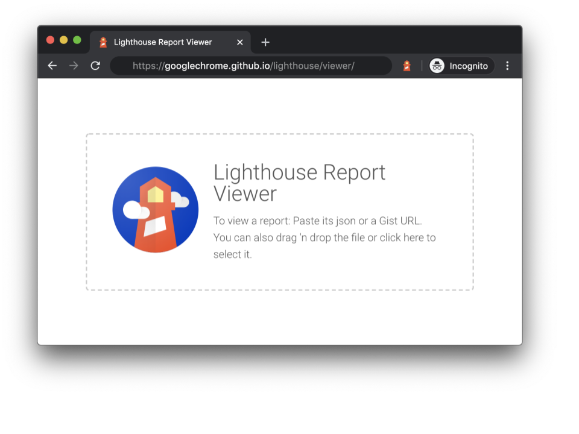

# Lighthouse

[Lighthouse](https://github.com/GoogleChrome/lighthouse) is an automated tool for improving the quality of web pages. You can run it against any web page, public or requiring authentication. It has audits for performance, accessibility, progressive web apps, SEO and more.

You can run Lighthouse in Chrome DevTools, from the command line, or as a Node module. You give Lighthouse a URL to audit, it runs a series of audits against the page, and then it generates a report on how well the page did. From there, use the failing audits as indicators on how to improve the page. Each audit has a reference doc explaining why the audit is important, as well as how to fix it.

You can also use [Lighthouse CI](https://github.com/GoogleChrome/lighthouse-ci/blob/master/docs/getting-started.md) to prevent regressions on your sites.

[Check out the video from Google I/O 2019 to learn more about how to use and contribute to Lighthouse.](https://youtu.be/mLjxXPHuIJo)

## Get started

Choose the Lighthouse workflow that suits you best:

-   In Chrome DevTools. Easily audit pages that require authentication, and read your reports in a user-friendly format.
-   From the command line. Automate your Lighthouse runs via shell scripts.
-   As a Node module. Integrate Lighthouse into your continuous integration systems.
-   From a web UI. Run Lighthouse and link to reports without installing a thing.

> Note: The CLI and Node workflows require you to have an instance of Google Chrome installed on your machine.

### Run Lighthouse in Chrome DevTools

Lighthouse powers the Audits panel of Chrome DevTools. To run a report:

1. Download [Google Chrome for Desktop](https://www.google.com/chrome/browser/desktop/).
2. In Google Chrome, go to the URL you want to audit. You can audit any URL on the web.
3. [Open Chrome DevTools](https://developers.google.com/web/tools/chrome-devtools#open).
4. Click the **Audits** tab.

  

> **Figure 1**. To the left is the viewport of the page that will be audited. To the right is the **Audits** panel of Chrome DevTools, which is now powered by Lighthouse

5. Click **Perform an audit**. DevTools shows you a list of audit categories. Leave them all enabled.
6. Click **Run audit**. After 30 to 60 seconds, Lighthouse gives you a report on the page.

  

> **Figure 2**. A Lighthouse report in Chrome DevTools

### Install and run the Node command line tool

To install the Node module:

1. Download [Google Chrome for Desktop](https://www.google.com/chrome/browser/desktop/). Download [Google Chrome for Desktop](https://www.google.com/chrome/browser/desktop/).
2. Install the current [Long-Term Support](https://github.com/nodejs/LTS) version of [Node](https://nodejs.org/).
3. Install Lighthouse. The `-g` flag installs it as a global module.

`npm install -g lighthouse`

To run an audit:

`lighthouse <url>`

To see all the options:

`lighthouse --help`

**Run the Node module programmatically**

See [Using programmatically](https://github.com/GoogleChrome/lighthouse/blob/master/docs/readme.md#using-programmatically) for an example of running Lighthouse programmatically, as a Node module.

### Run Lighthouse as a Chrome Extension

> Note: Unless you have a specific reason, you should use the Chrome DevTools workflow rather than this Chrome Extension workflow. The DevTools workflow allows for testing local sites and authenticated pages, while the extension does not.

To install the extension:

1. Download Google Chrome for Desktop.

2. Install the Lighthouse Chrome Extension from the Chrome Webstore.

To run an audit:

1. In Chrome, go to the page you want to audit.

2. Click **Lighthouse**. It should be next to the Chrome address bar. If not, open Chrome's main menu and access it at the top of the menu. After clicking, the Lighthouse menu expands.

  

> **Figure 3**. The Lighthouse menu

3. Click **Generate report**. Lighthouse runs its audits against the currently-focused page, then opens up a new tab with a report of the results.

  

> **Figure 4**. A Lighthouse report

### Run PageSpeed Insights

To run Lighthouse on PageSpeed Insights:

1. Navigate to PageSpeed Insights.
2. Enter a web page URL.
3. Click Analyze.

  

> **Figure 5**. The PageSpeed Insights UI

## Share and view reports online

Use the [Lighthouse Viewer](https://googlechrome.github.io/lighthouse/viewer/) to view and share reports online.

  

> **Figure 6**. The Lighthouse Viewer

### Share reports as JSON

The Lighthouse Viewer needs the JSON output of a Lighthouse report. The list below explains how to get the JSON output, depending on what Lighthouse workflow you're using:

-   **Chrome DevTools**. Click **Download Report** 

-   **Command line**. Run:
    `lighthouse --output json --output-path <path/for/output.json>`

-   **Lighthouse Viewer**. Click **Export** > **Save as JSON**.

To view the report data:

1. Open the [Lighthouse Viewer](https://googlechrome.github.io/lighthouse/viewer/) in Google Chrome.
2. Drag the JSON file onto the viewer, or click anywhere on the Viewer to open your file navigator and select the file.

### Share reports as GitHub Gists

If you don't want to manually pass around JSON files, you can also share your reports as secret GitHub Gists. One benefit of Gists is free version control.

To export a report as a Gist from the report:

1. (If already on the viewer, skip this step) Click **Export** > **Open In Viewer**. The report opens in the Viewer, located at  
   `https://googlechrome.github.io/lighthouse/viewer/.`

2. In the Viewer, click Share **Share**. The first time you do this, a popup asks permission to access your basic GitHub data, and to read and write to your Gists.

To export a report as a Gist from the CLI version of Lighthouse, just manually create a Gist and copy-paste the report's JSON output into the Gist. The Gist filename containing the JSON output must end in `.lighthouse.report.json.` See [Share reports as JSON](https://developers.google.com/web/tools/lighthouse#json) for an example of how to generate JSON output from the command line tool.

To view a report that's been saved as a Gist:

-   Add `?gist=<ID>` to the Viewer's URL, where `<ID>` is the ID of the Gist.
    `https://googlechrome.github.io/lighthouse/viewer/?gist=<ID>`

-   Open the [Viewer](https://googlechrome.github.io/lighthouse/viewer/), and paste the URL of a Gist into it.

## Lighthouse extensibility

Lighthouse aims to provide guidance that is relevant and actionable for all web developers. To this end, there are two features now available that allow you to tailor Lighthouse to your specific needs.

-   **Stack Packs**. Many developers today use different technologies (backend/CMS/JavaScript frameworks) to build their web pages. Instead of only surfacing general recommendations, Lighthouse is now able to provide more relevant and actionable advice depending on the tools used.
    Stack Packs allow Lighthouse to detect what platform your site is built on and display specific stack-based recommendations. These recommendations are defined and curated by experts from the community.

To contribute a Stack Pack, review the [Contributing Guidelines](https://github.com/GoogleChrome/lighthouse-stack-packs/blob/master/CONTRIBUTING.md).

-   **Lighthouse Plugins**. Lighthouse Plugins allow domain experts in the community to extend the functionality of Lighthouse for their specific needs. You are now able to leverage the data that Lighthouse collects to create new audits. At its core, a Lighthouse plugin is a node module that implements a set of checks that will be run by Lighthouse and added to the report as a new category.

For more information about how to create your own plugin, check out our [Plugin Handbook](https://github.com/GoogleChrome/lighthouse/blob/master/docs/plugins.md) in the Lighthouse GitHub repo.

## Integrate Lighthouse

If you are a company or an individual who is integrating Lighthouse as part of the products / services you're offering, first things first - we're so excited you are! We want as many people as possible to use Lighthouse, and this [Guidelines and Brand Assets for Integrating Lighthouse](https://docs.google.com/document/d/e/2PACX-1vRWKW9RiB3suYt1KqgBJhwLnvV-AiFne8iAudADtwK-LWLNParYsFts92InHNtB_BV5x-xtSVcnTO2n/pub) is meant to make it straightforward for you to show that Lighthouse is under the hood while protecting our brand.
