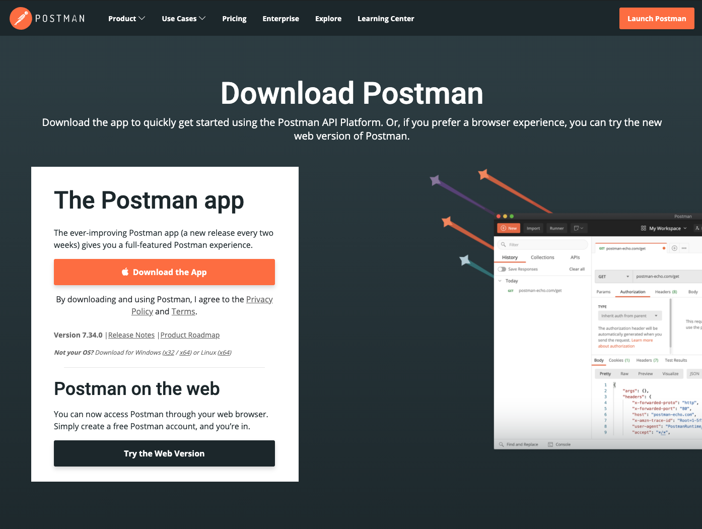
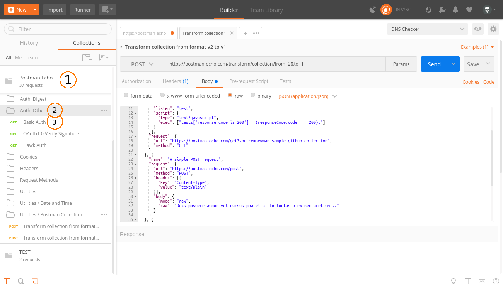
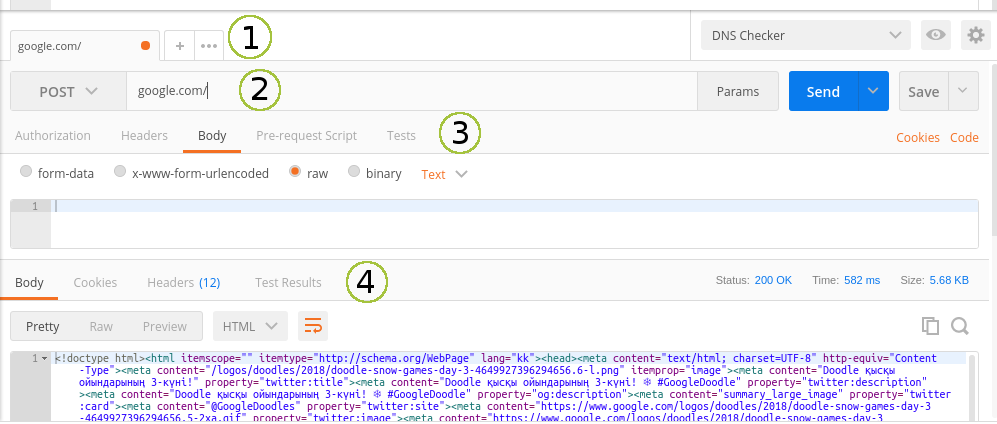
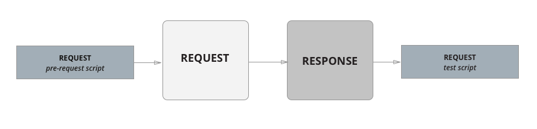
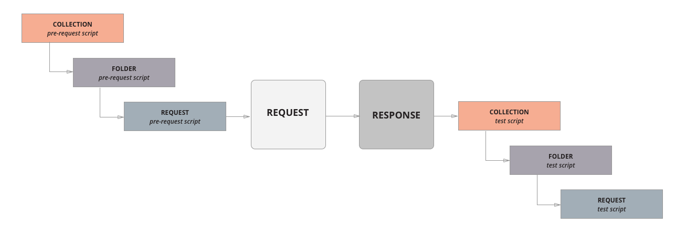
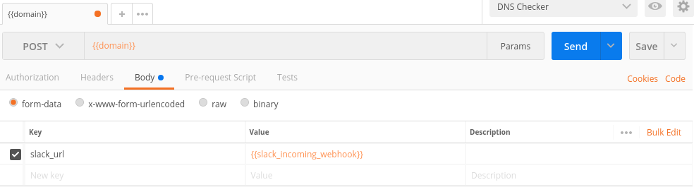
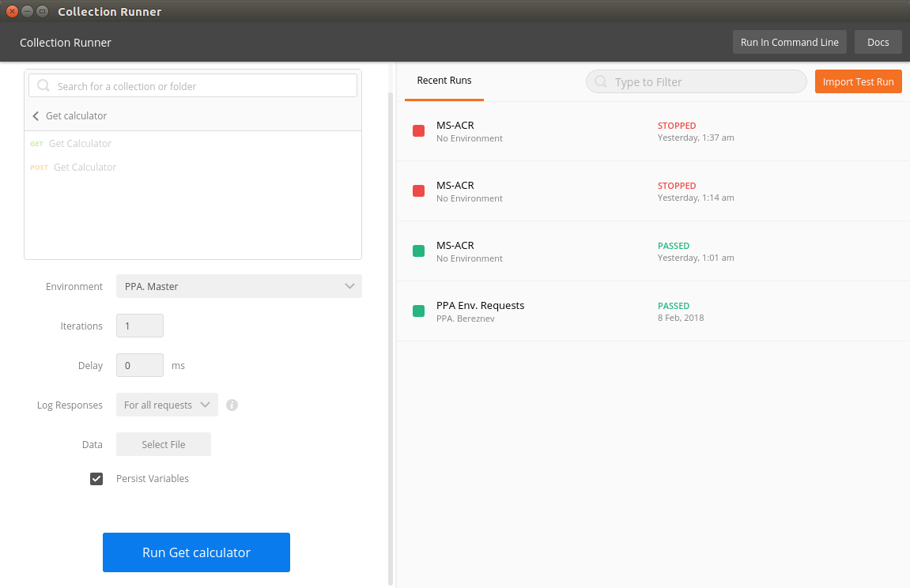
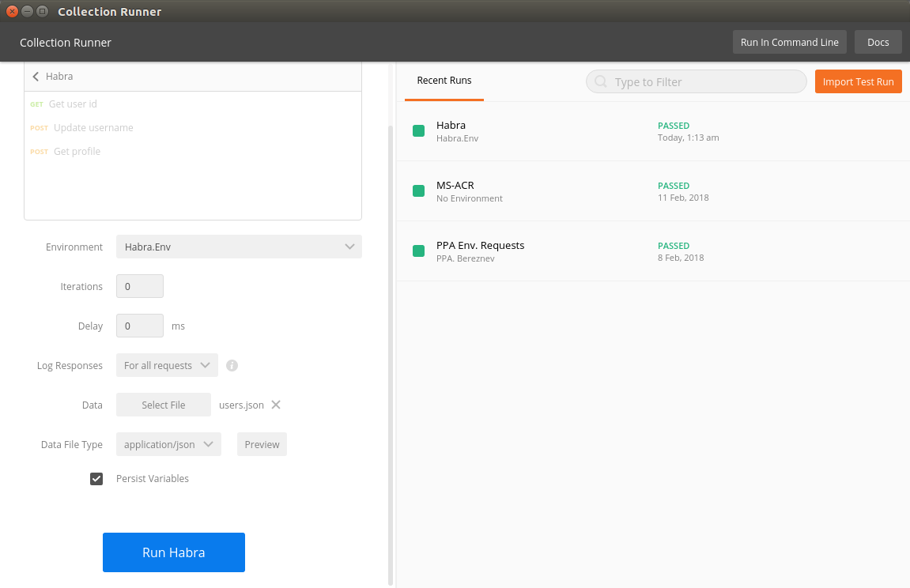

# Postman

> “Разработка API сложна, Postman делает её лёгкой” © Postdot Technologies, Inc

## Установка

Для установки Postman на компьютер необходимо перейти на этот [сайт](https://www.postman.com/downloads/).

После этого на странице выбрать вашу операционную систему и нажать кнопку загрузить.

<p align="center">
  
</p>

Основное предназначение приложения — создание коллекций с запросами к вашему API. Любой разработчик или тестировщик, открыв коллекцию, сможет с лёгкостью разобраться в работе вашего сервиса. Ко всему прочему, Postman позволяет проектировать дизайн API и создавать на его основе Mock-сервер. Вашим разработчикам больше нет необходимости тратить время на создание "заглушек". Реализацию сервера и клиента можно запустить одновременно. Тестировщики могут писать тесты и производить автоматизированное тестирование прямо из Postman. А инструменты для автоматического документирования по описаниям из ваших коллекций сэкономят время на ещё одну "полезную фичу". Есть кое-что и для администраторов — авторы предусмотрели возможность создания коллекций для мониторинга сервисов.

## Введение

<p align="center">
  
</p>

> **1** — коллекция, **2** — папка, **3** — запрос

Главные понятия, которыми оперирует Postman это Collection (коллекция) на верхнем уровне, и Request (запрос) на нижнем. Вся работа начинается с коллекции и сводится к описанию вашего API с помощью запросов. Давайте рассмотрим подробнее всё по порядку.

### Collection

Коллекция — отправная точка для нового API. Можно рассматривать коллекцию, как файл проекта. Коллекция объединяет в себе все связанные запросы. Обычно API описывается в одной коллекции, но если вы желаете, то нет никаких ограничений сделать по-другому. Коллекция может иметь свои скрипты и переменные, которые мы рассмотрим позже.

### Folder

Папка — используется для объединения запросов в одну группу внутри коллекции. К примеру, вы можете создать папку для первой версии своего API — "v1", а внутри сгруппировать запросы по смыслу выполняемых действий — "Order & Checkout", "User profile" и т. п. Всё ограничивается лишь вашей фантазией и потребностями. Папка, как и коллекция может иметь свои скрипты, но не переменные.

### Request

Запрос — основная составляющая коллекции, то ради чего все и затевалось. Запрос создается в конструкторе. Конструктор запросов это главное пространство, с которым вам придётся работать. Postman умеет выполнять запросы с помощью всех стандартных HTTP методов, все параметры запроса под вашим контролем. Вы с лёгкостью можете поменять или добавить необходимые вам заголовки, cookie, и тело запроса. У запроса есть свои скрипты. Обратите внимание на вкладки "Pre-request Script" и "Tests" среди параметров запроса. Они позволяют добавить скрипты перед выполнением запроса и после. Именно эти две возможности делают Postman мощным инструментом помогающим при разработке и тестировании.

<p align="center">
  
</p>

> **1** — вкладки с запросами, **2** — URL и метод, **3** — параметры запроса, **4** — параметры ответа

### Скрипты

"Postman Sandbox" это среда исполнения JavaScript доступная при написании "Pre-request Script" и "Tests" скриптов. "Pre-request Script" используется для проведения необходимых операций перед запросом, например, можно сделать запрос к другой системе и использовать результат его выполнения в основном запросе. "Tests" используется для написания тестов, проверки результатов, и при необходимости их сохранения в переменные.

<p align="center">
  
</p>

> **Последовательность выполнения запроса (из оф. документации)**

Помимо скриптов на уровне запроса, мы можем создавать скрипты на уровне папки, и, даже, на уровне коллекции. Они называются также — "Pre-request Script" и "Tests", но их отличие в том, что они будут выполняться перед каждым и после каждого запроса в папке, или, как вы могли догадаться, во всей коллекции.postman5

<p align="center">
  
</p>

> **Последовательность выполнения запроса со скриптами папок и коллекций (из оф. документации)**

### Переменные

Postman имеет несколько пространств и областей видимости для переменных:

-   Глобальные переменные
-   Переменные коллекции
-   Переменные окружения
-   Локальные переменные
-   Переменные уровня данных

Глобальные переменные и переменные окружения можно создать, если нажать на шестеренку в правом верхнем углу программы. Они существуют отдельно от коллекций. Переменные уровня коллекции создаются непосредственно при редактировании параметров коллекции, а локальные переменные из выполняемых скриптов. Также существуют переменные уровня данных, но они доступны только из Runner, о котором мы поговорим позже.

<p align="center">
  
</p>

> **Приоритет пространств переменных (из оф. документации)**

Особенностью переменных в Postman является то, что вы можете вставлять их в конструкторе запроса, в URL, в POST параметры, в Cookie, всюду, используя фигурные скобки в качестве плейсхолдера для подстановки.

<p align="center">
  
</p>

> **{{domain}}** и **{{slack_incoming_webhook}}** — переменные окружения DNS Checker будут заменены на значения во время выполнения запроса

Из скриптов переменные тоже доступны, но получить их поможет вызов стандартного метода встроенной библиотеки pm:

```
//получить глобальную переменную
pm.globals.get("variable_key");
// получить переменную из окружения
pm.environment.get("variable_key");
// получить переменную из любого пространства согласно приоритету
pm.variables.get("variable_key");
```

### Collection Runner

Предназначен для тестирования и выполнения всех запросов из коллекции или папки, на ваш выбор. При запуске можно указать количество итераций, сколько раз будет запущена папка или коллекция, окружение, а также дополнительный файл с переменными. Стоит упомянуть, что запросы выполняются последовательно, согласно расположению в коллекции и папках. Порядок выполнения можно изменить используя встроенную команду:

```
// Следующим выполнится запрос с названием "Create order",
postman.setNextRequest('Create order');
```

После выполнения всех запросов формируется отчет, который покажет количество успешных и провальных проверок из скриптов "Tests".

<p align="center">
  
</p>

> **Collection Runner**

### Console

Пользуйтесь консолью для отладки ваших скриптов, и просмотра дополнительной информации по запросам. Консоль работает, как во время запуска одного запроса, так и во время запуска пакета запросов через Runner. Чтобы её открыть, найдите иконку консоли в нижнем левом углу основного экрана приложения:

<p align="center">
  
</p>

## Практика

Так как создание коллекций и запросов в конструкторе не должно вызвать затруднений, практическую часть посвятим написанию скриптов, и рассмотрим как создать цепочку запросов с тестами. Перед началом создайте новую коллекцию, назовите её “Habra”, затем создайте новое окружение под названием "Habra. Env"

### Шаг 1

Создайте новый запрос, в качестве URL укажите `https://postman-echo.com/get?userId=777` , а метод оставьте GET. Здесь и далее для простоты и удобства мы будем использовать echo-сервер любезно предоставленный разработчиками Postman. Сохраните запрос в коллекцию "Habra" и назовите “Get user id”, он будет имитировать получение идентификатора пользователя от сервера. Перейдите на вкладку "Tests" и напишите следующий код:

```
// Тестируем статус ответа и формат
pm.test("Status is ok, response is json", function () {
    pm.response.to.be.ok; // проверка статуса
    pm.response.to.be.json; // проверка формата
});

try {
    // сохраняем userId из json ответа в переменную окружения
    pm.environment.set("userId", pm.response.json().args.userId);
} catch(e) {
    // выводим исключение в консоль
    console.log(e);
}
```

С помощью этого скрипта мы проверили статус и формат ответа, а также сохранили полученный из ответа идентификатор пользователя в переменную окружения для последующего использования в других запросах. Чтобы проверить работу нашего теста, запустите запрос. В панели информации об ответе, во вкладке "Tests" вы должны увидеть зелёный лейбл “PASS”, а рядом надпись **“Status is ok, response is json”**.

### Шаг 2

Теперь давайте попробуем вставить идентификатор нашего пользователя в json запрос. Создайте новый запрос, в качестве **URL** укажите `https://postman-echo.com/post` , выберите метод **POST**, установите тип для тела запроса **raw — application/json**, а в само тело вставьте:

```
{"userId": {{userId}}, "username": "Bob"}
```

Сохраните запрос в нашу коллекцию, и назовите "Update username", он будет запрашивать импровизированную конечную точку для обновления username пользователя. Теперь при вызове запроса вместо **{{userId}}** система автоматически будет подставлять значение из переменной окружения. Давайте проверим, что это действительно так, и напишем небольшой тест для нашего нового запроса:

```
// тестируем статус ответа и формат
pm.test("Status is ok, response is json", function () {
    pm.response.to.be.ok;
    pm.response.to.be.json;
});

// проверим, что userId из окружения равен userId из ответа
pm.test("userId from env is equal to userId from response", function () {
    pm.expect(parseInt(pm.environment.get("userId"))).to.equal(
        pm.response.json().data.userId
    );
});
```

В нашем новом тесте мы сравниваем полученный от сервера **userId** с тем, что хранится у нас в переменной окружения, они должны совпадать. Запустите запрос и убедитесь, что тесты прошли. Хорошо, двигаемся дальше.

### Шаг 3

Вы могли заметить, что два тестовых скрипта имеют одинаковую проверку формата и статуса:

```
pm.test("Status is ok, response is json", function () {
    pm.response.to.be.ok;
    pm.response.to.be.json;
});
```

Пока мы не зашли слишком далеко, давайте исправим эту ситуацию и перенесем эти тесты на уровень коллекции. Откройте редактирование нашей коллекции, и перенесите проверку формата и статуса во вкладку "Tests", а из запросов их можно удалить. Теперь эти проверки будут автоматически вызываться перед скриптами "Tests" для каждого `запроса` в коллекции. Таким образом мы избавились от копирования данной проверки в каждый запрос.

### Шаг 4

Мы научились записывать и получать переменные окружения, настало время перейти к чему-то потяжелее. Давайте воспользуемся встроенной библиотекой _tv4_ (TinyValidator) и попробуем проверить правильность схемы json объекта. Создайте новый запрос, в качестве URL используйте `https://postman-echo.com/post` , установите метод в значение **POST**, для тела запроса укажите **raw — application/json**, и вставьте в него:

```
{
    "profile" : {
        "userId": {{userId}},
        "username": "Bob",
        "scores": [1, 2, 3, 4, 5],
        "age": 21,
        "rating": {"min": 20, "max": 100}
    }
}
```

После запуска запроса echo-сервер должен вернуть нам нашу json модель в качестве ответа в поле **"data"**, таким образом мы имитируем работу реального сервера, который мог бы прислать нам информацию о профиле Боба. Модель готова, напишем тест, проверяющий правильность схемы:

```
// получаем профиль из ответа
var profile = pm.response.json().data.profile;

// описываем схему модели
var scheme = {
    // указываем тип объекта
    "type": "object",
    // указываем обязательные свойства
    "required": ["userId", "username"],
    // описываем свойства
    "properties": {
        "userId": {"type": "integer"},
        "username": {"type": "string"},
        "age": {"type": "integer"},
        // описываем массив
        "scores": {
            "type": "array",
            // тип элементов
            "items": {"type": "integer"}
        },
        // описываем вложенный объект
        "rating": {
            "type": "object",
            "properties": {
                "min": {"type": "integer"},
                "max": {"type": "integer"}
            }
        }
    }
};

pm.test('Schema is valid', function() {
    // валидируем объект profile с помощью правил из scheme
    var isValidScheme = tv4.validate(profile, scheme, true, true);

    // ожидаем, что результат валидации true
    pm.expect(isValidScheme).to.be.true;
});
```

Готово, мы провалидировали схему объекта **profile**. Запустите запрос и убедитесь, что тесты проходят.

### Шаг 5

У нас получился небольшой путь из 3-х запросов и нескольких тестов. Настало время полностью его протестировать. Но перед этим, давайте внесем небольшую модификацию в наш первый запрос: замените значение **“777”** в URL на плейсхолдер **“{{newUserId}}”**, и через интерфейс добавьте в окружение **"Habra. Env"** переменную **“newUserId”** со значением **“777”**. Создайте файл **users.json** на своём компьютере и поместите туда следующий json массив:

```
[
    {"newUserId": 100},
    {"newUserId": 200},
    {"newUserId": 300},
    {"newUserId": 50000}
]
```

Теперь запустим Runner. В качестве "Collection Folder" выберем **"Habra"**. В качестве "Environment" поставим **"Habra. Env"**. Количество итераций оставляем 0, а в поле "Data" выбираем наш файл **users.json**. По этому файлу "Collection Runner" поймет, что ему нужно совершить 4 итерации, и в каждой итерации он заменит значение переменной "newUserId" значением из массива в файле. Если указать количество итераций больше, чем количество элементов в массиве, то все последующие итерации будут происходить с последним значением из массива данных. В нашем случае после 4 итерации значение "newUserId" всегда будет равно 50000. Наш “Data” файл поможет пройти весь наш путь с разными newUserId, и убедиться, что независимо от пользователя все выполняется стабильно.

Запускаем наши тесты нажатием **"Run Habra"**. Поздравляем вы успешно создали коллекцию и протестировали наш импровизированный путь с помощью автотестов!

<p align="center">
  
</p>

> **Тестирование коллекции "Habra"**

Теперь вы знаете, как создавать скрипты и вполне можете написать парочку тестов для своего проекта.

Надо отметить, что в реальном проекте мы не держим все запросы в корне коллекции, а стараемся раскладывать их по папкам. Например, в папке **"Requests"** мы складываем все возможные запросы описывающие наш API, а тесты храним в отдельной папке **"Tests"**. И когда нам нужно протестировать проект, в "Runner" запускаем только папочку **"Tests"**.

## Дополнительно

В завершении приведем основные команды, которые вам могут понадобиться во время написания скриптов. Для лучшего усвоения, попробуйте поиграться с ними самостоятельно.

### Установка и получение переменных

```
// глобальные переменные
pm.globals.set(“key”, “value”);
pm.globals.get(“key”);

// переменные окружения
pm.environment.set(“key”, “value”);
pm.environment.get(“key”);

// локальные переменные
pm.variables.set(“key”, “value”);
pm.variables.get(“key”); // если нет локальной, будет искать на уровне выше
```

### Тестирование или asserts

```
// с использованием анонимной функции и специальных assert конструкций
pm.test(“Название теста”, function () {
    pm.response.to.be.success;
    pm.expect(“value”).to.be.true;
    pm.expect(“other”).to.equal(“other”);
});
// с использованием простого условия и массива tests
tests[“Название теста”] = (“a” != “b”);
tests[“Название теста 2”] = true;
```

### Создание запросов

```
// пример get запроса
pm.sendRequest(“https://postman-echo.com/get”, function (err, res) {
    console.log(err);
    console.log(res);
});
// пример post запроса
let data = {
    url: “https://postman-echo.com/post”,
    method: “POST”,
    body: { mode: “raw”, raw: JSON.stringify({ key: “value” })}
};

pm.sendRequest(data, function (err, res) {
    console.log(err);
    console.log(res);
});
```

### Получение ответа для основного запроса

```
pm.response.json(); // в виде json
pm.response.text(); // в виде строки
responseBody; // в виде строки
```

Ответ доступен только во вкладке **“Tests”**

### Работа со встроенными библиотеками

Документация регламентирует наличие некоторого количества встроенных библиотек, среди которых — tv4 для валидации json, xml2js конвертер xml в json, crypto-js для работы с шифрованием, atob, btoa и др.

```
// подключение xml2js
var xml2js = require(“xml2js”);
// преобразование простого xml в json объект
xml2js.parseString("<root>Hello xml2js!</root>", function(err, res) {
    console.log(res);
});
```

Некоторые из библиотек, например, как tv4 не требуют прямого подключения через require и доступны по имени сразу.

### Получение информации о текущем скрипте

```
pm.info.eventName; // вернет test или prerequest в зависимости от контекста
pm.info.iteration; // текущая итерация в Runner
pm.info.iterationCount; // общее количество итераций
pm.info.requestName; // название текущего запроса
pm.info.requestId; // внутренний идентификатор запроса
```

### Управление последовательностью запросов из скрипта

Стоит отметить, что данный метод работает только в режиме запуска всех скриптов.

```
// установить следующий запрос
postman.setNextRequest(“Название запроса”); // по названию
postman.setNextRequest(ID); // по идентификатору
// остановить выполнение запросов
postman.setNextRequest(null);
```

После перехода на следующий запрос Postman возвращается к линейному последовательному выполнению запросов.

### Создание глобального хелпера

В некоторых случаях вам захочется создать функции, которые должны быть доступны во всех запросах. Для этого в первом запросе в секции **“Pre-request Script”** напишите следующий код:

```
// создаем и сохраняем хелпер для глобального использования
pm.environment.set("pmHelper", function pmHelper() {
    let helpers = {};

    helpers.usefulMethod = function() {
        console.log(“It is helper, bro!”);
    };

    return helpers;
} + '; pmHelper();');
```

А в последующих скриптах пользуемся им так:

```
// получаем объект
var pmHelper = eval(pm.environment.get("pmHelper"));
// вызываем наш метод
pmHelper.usefulMethod();
```

Это лишь небольшой список полезных команд. Возможности скриптов гораздо шире, чем можно осветить в одной статье. В Postman есть хорошие **"Templates"**, которые можно найти при создании новой коллекции. Не стесняйтесь подглядывать и изучать их реализацию. А официальная документация содержит ответы на большинство вопросов.

-   [Официальный сайт](https://www.getpostman.com/)
-   [Документация по Postman](https://www.getpostman.com/docs/)
-   [Список встроенных библиотек](https://www.getpostman.com/docs/postman/scripts/postman_sandbox_api_reference)

## Заключение

Основные плюсы, которые подтолкнули нас к использованию Postman в своём проекте:

-   Наглядность – все запросы всегда под рукой, мануальное тестирование во время разработки становится легче
-   Быстрый старт – вовлечение нового игрока в команду, будь то программист или тестировщик, проходит легко и быстро
-   Тесты – возможность писать тесты для запросов, а потом быстро составлять из них, как из пазлов, различные варианты и пути жизни приложения
-   Поддержка CI — возможность интегрировать тесты в CI с помощью newman (об этом будет отдельная статья)

Среди минусов можно выделить:

-   Редактирование коллекции привязано к Postman, т. е. для изменений потребуется сделать импорт, отредактировать, а затем сделать экспорт в репозиторий проекта
-   Так как коллекция лежит в одном большом json файле, Review изменений практически невозможно

У каждого проекта свои подходы и взгляды на тестирование и разработку. Мы увидели для себя больше плюсов, чем минусов, и поэтому решили использовать этот мощный инструмент, как для тестирования, так и для описания запросов к API нашего проекта. И по своему опыту можем сказать, даже, если вы не будете использовать средства тестирования, которые предоставляет Postman, то иметь описание запросов в виде коллекции будет весьма полезно. Коллекции Postman это живая, интерактивная документация к вашему API, которая сэкономит множество времени, и в разы ускорит разработку, отладку и тестирование!
