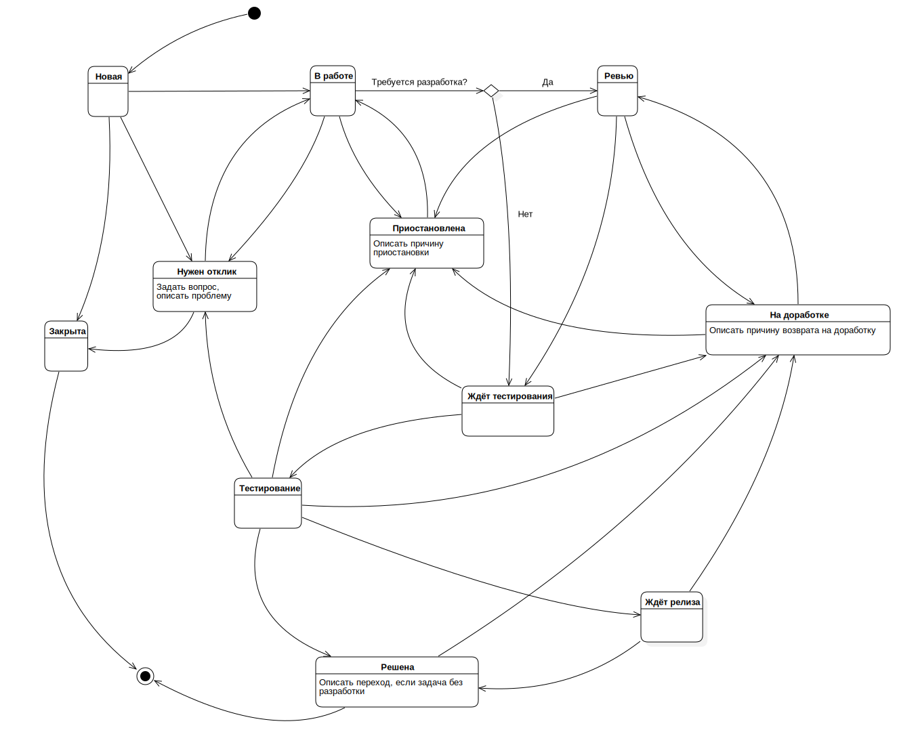

# Redmine

**Redmine** - веб-приложение, используемое для управления проектами и задачами.
**Redmine** написан на **Ruby** и представляет собой приложение на основе широко известного веб-фреймворка **Ruby on Rails**.

## Создание задач

1. Выбрать необходимый проект;
2. Создать задачу _Новая задача_ или в группе задач, раздел _Подзадачи_ &#8594; _Добавить_;
3. Выбрать тип трекера **Улучшение**, **Разработка**, **Ошибка**, **Группа** (подзадачи создаются только в группах);
4. Описать тело задачи, если задача на доработку или на создание нового функционала (трекеры **Улучшение** и **Разработка**);
5. Описать воспроизведение ошибки (если трекер **Ошибка**);
6. Назначить предположительное время выполнения (разработчики и менеджеры);
7. Назначить дату завершения;
8. Назначить приоритет;
9. Перевести задачу в статус **Новая**, если задача требует обсуждения или дизайна или что-то ещё, оставлять назначенной на создателя.

Задачи которые требуют доработки серверной части или фронтовой, описать по пунктам в теле задачи (не создавать подзадачи для фронта и бэкэнда, не понятна последовательность выполнения).

<pre>
Плохое описание или недостаточно понятно описанные шаги воспроизведения, задача будет сделана соответственно. 
</pre>

## Выполнение

У задачи обязательно должно быть описание или шаги воспроизведения. Без данных пунктов, задачу в работу не брать.

Если задача общая для бэкэнда и фронта, первый берёт тот на чьей стороне стоит описание сначала, после выполнения переводит на нужную сторону.

### Этапы выполнения

1. Задача назначается на исполнителя в статусе **Новая**;
2. Исполнитель взяв задачу в работу изменяет её статус на **В работе**;
3. После выполнения, задача переводится в статус **Ревью**, процент выполнения меняется на **30%**;
4. После успешно пройденного ревью, перевести задаву в статус **Ждёт тестирования**, сменить процент выполнения на **70%**;
5. После деплоя на <u>test сервер</u> ветки `release`, задача переводится в статус **Тестирование**, процент выполнения меняется на **90%**;
6. Пройдя успешное тестирование, ветка `release` деплоится на <u>production сервер</u>, задача переводится в статус **Решена**, процент выполнения меняется на **100%**.

### Смена исполнителя

1. Перевести задачу на нужного исполнителя;
2. Описать причину в комментарии;
3. Оставить ссылку на **Pull Request** (если есть);
4. Оставить название ветки, в которой ведётся разработка.

### Статусы

Каждая задача имеет статус, который указывает, в каком состоянии в настоящее время находится задача.
Разработчики, тестировщики и менеджеры могут редактировать статусы в соответствии графу состояний.

