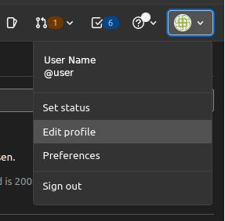
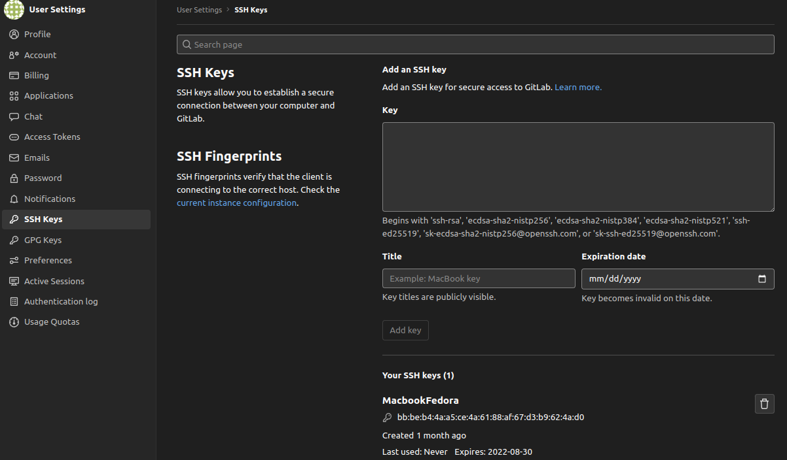
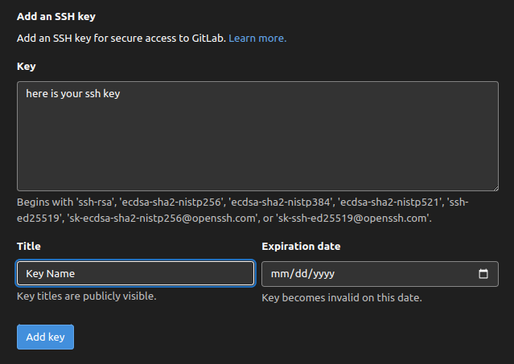

# SSH

## Генерация SSH ключа

Многие Git-серверы используют аутентификацию по открытым SSH-ключам.
Для того чтобы предоставить открытый ключ, каждый пользователь в системе должен его сгенерировать,
если только этого уже не было сделано ранее. Этот процесс аналогичен во всех операционных системах.
Сначала вам стоит убедиться, что у вас ещё нет ключа. По умолчанию пользовательские SSH ключи сохраняются
в каталоге `~/.ssh` домашней директории пользователя. Вы можете легко проверить наличие ключа зайдя в этот
каталог и посмотрев его содержимое:

```bash
$ cd ~/.ssh
$ ls
authorized_keys2  id_dsa       known_hosts
config            id_dsa.pub
```

Ищите файл с именем `id_dsa` или `id_rsa` и соответствующий ему файл с расширением `.pub` .
Файл с расширением `.pub` -это ваш открытый ключ, а второй файл-ваш приватный ключ.

### Шаг 1

1.  Если указанные файлы у вас отсутствуют (или даже нет каталога `.ssh`),
    вы можете создать их используя программу `ssh-keygen` , которая входит в состав пакета SSH в системах Linux/Mac, а для Windows поставляется вместе с Git:

```bash
$ ssh-keygen
Generating public/private rsa key pair.
Enter file in which to save the key (/home/schacon/.ssh/id_rsa):
Created directory '/home/schacon/.ssh'.
Enter passphrase (empty for no passphrase):
Enter same passphrase again:
Your identification has been saved in /home/schacon/.ssh/id_rsa.
Your public key has been saved in /home/schacon/.ssh/id_rsa.pub.
The key fingerprint is:
d0:82:24:8e:d7:f1:bb:9b:33:53:96:93:49:da:9b:e3 schacon@mylaptop.local
```

2. Сначала программа попросит указать расположение файла для сохранения ключа - нажмите Enter, чтобы принять ключ и
   путь по умолчанию, `/c/Users/<username>/.ssh/id_rsa` ,
   затем дважды ввести пароль для шифрования. Если вы не хотите вводить пароль каждый раз при использовании ключа,
   то можете оставить его пустым или использовать программу `ssh-agent` . Открытый ключ выглядит примерно так:

```bash
$ cat ~/.ssh/id_rsa.pub
ssh-rsa AAAAB3NzaC1yc2EAAAABIwAAAQEAklOUpkDHrfHY17SbrmTIpNLTGK9Tjom/BWDSU
GPl+nafzlHDTYW7hdI4yZ5ew18JH4JW9jbhUFrviQzM7xlELEVf4h9lFX5QVkbPppSwg0cda3
Pbv7kOdJ/MTyBlWXFCR+HAo3FXRitBqxiX1nKhXpHAZsMciLq8V6RjsNAQwdsdMFvSlVK/7XA
t3FaoJoAsncM1Q9x5+3V0Ww68/eIFmb1zuUFljQJKprrX88XypNDvjYNby6vw/Pb0rwert/En
mZ+AW4OZPnTPI89ZPmVMLuayrD2cE86Z/il8b+gw3r3+1nKatmIkjn2so1d01QraTlMqVSsbx
NrRFi9wrf+M7Q== schacon@mylaptop.local
```

### Шаг 2

Добавьте открытый ключ в настройки своей учетной записи.

1. В GitLab кликните на свой аватар в правом верхнем углу и нажмите на «Edit profile» своего.

    <p align="center">
      
    </p>

2. Кликните SSH Keys в боковом меню. Если вы уже добавили ключи, вы увидите их на этой странице.

    <p align="center">
      
    </p>

3. В окне терминала скопируйте содержимое файла открытого ключа. Если вы переименовали ключ, замените id_rsa.pub именем файла открытого ключа.

В Linux, вы можете скопировать содержания:

```bash
$ cat ~ / .ssh / id_rsa.pub
```

В macOS следующая команда копирует вывод в буфер обмена:

```bash
$ pbcopy <~ / .ssh / id_rsa.pub
```

4. Выделите и скопируйте ключевой вывод в буфер обмена.
   Если у вас возникли проблемы с копированием и вставкой, вы можете открыть файл напрямую с помощью Блокнота. Выберите содержимое файла (только не выбирайте символы конца файла).

5. Введите **метку** для вашего нового ключа, например, Открытый ключ по умолчанию .

    <p align="center">
      
    </p>

6. Вставьте скопированный открытый ключ в поле Key .
   При вставке вы можете увидеть адрес электронной почты в последней строке. Неважно, включаете ли вы адрес электронной почты в ключ. 

7. Кликните **Add key**.
