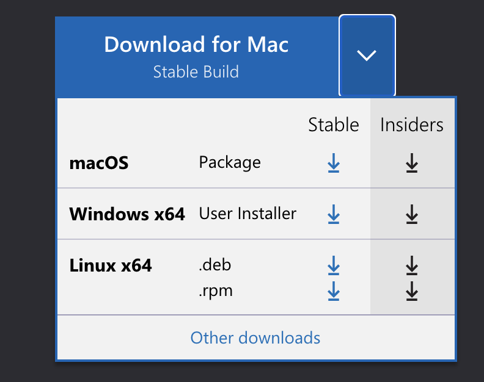
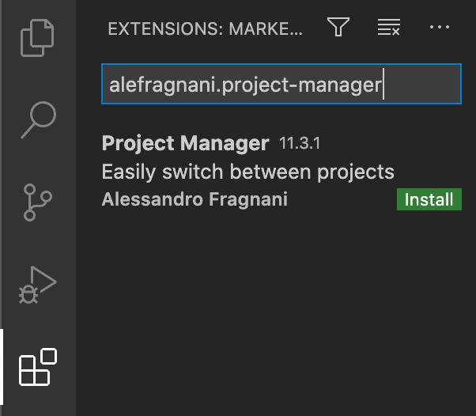
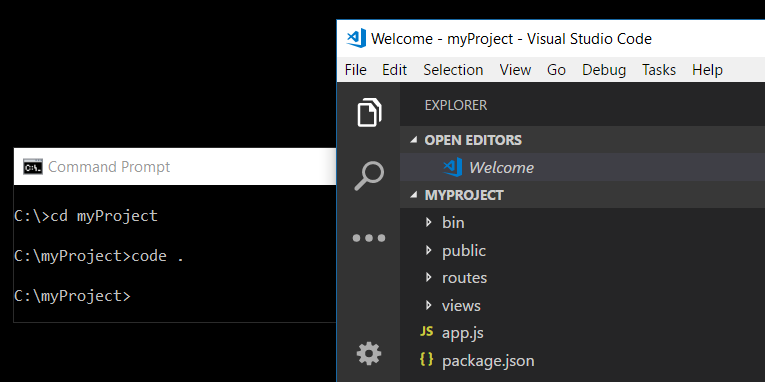
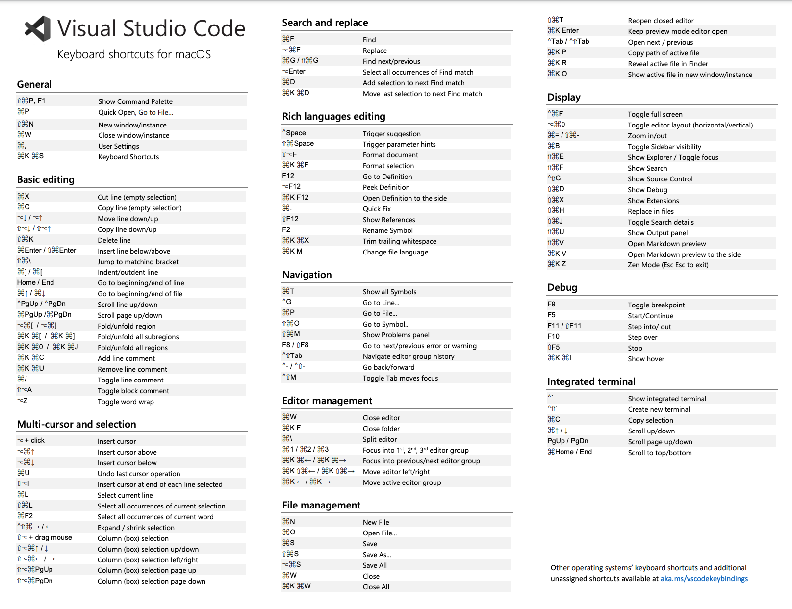
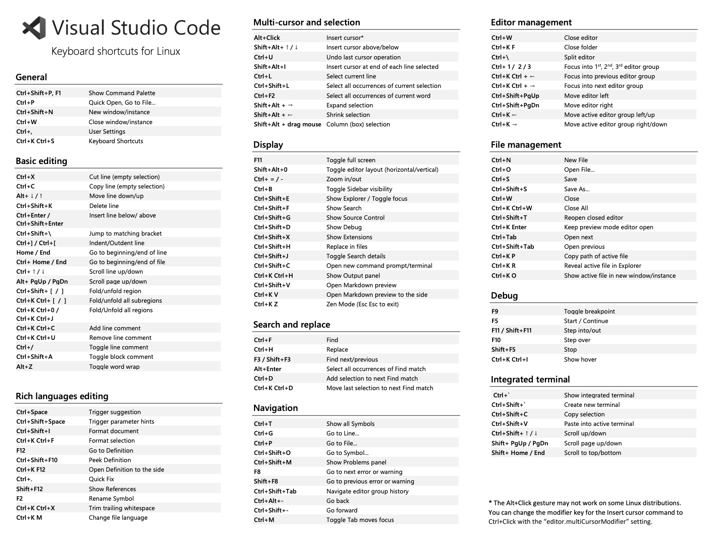

# VS Code

## Установка

Скачать [дистрибутив](https://code.visualstudio.com/), выбрав вашу операционную систему.

<p align="center">
  
</p>

В **Visual Studio Code** имеется огромное количество различных плагинов кроме языковых пакетов.

Предназначены они для расширения функциональности редактора.
Все плагины размещены на [Marketplace](https://marketplace.visualstudio.com/vscode).

## Необходимые плагины для работы

Чтобы добавить плагин, необходимо открыть **VS Code**, в меню слева найти элемент **Extensions** (см.ниже) и нажать на него.
В поисковой выдаче добавить плагин из списка, ознакомиться с плагином и нажать **install**

<p align="center">
  
</p>

### Список необходимых плагинов

-   alefragnani.project-manager
-   bierner.markdown-preview-github-styles
-   christian-kohler.npm-intellisense
-   christian-kohler.path-intellisense
-   chrmarti.regex
-   coderfee.open-html-in-browser
-   codezombiech.gitignore
-   CoenraadS.bracket-pair-colorizer
-   cssho.vscode-svgviewer
-   dariofuzinato.vue-peek
-   dbaeumer.vscode-eslint
-   diz.ecsstractor-port
-   donjayamanne.githistory
-   dracula-theme.theme-dracula
-   eamodio.gitlens
-   eg2.vscode-npm-script
-   EQuimper.react-native-react-redux
-   esbenp.prettier-vscode
-   formulahendry.auto-close-tag
-   formulahendry.auto-rename-tag
-   humy2833.ftp-simple
-   jwoelper.theme-miami
-   kumar-harsh.graphql-for-vscode
-   lamartire.git-indicators
-   liximomo.sftp
-   ms-vscode. Theme-MaterialKit
-   msjsdiag.debugger-for-chrome
-   mubaidr.vuejs-extension-pack
-   octref.vetur
-   oderwat.indent-rainbow
-   robertoachar.vscode-essentials-snippets
-   ryu1kn.annotator
-   shinnn.stylelint
-   sibiraj-s.vscode-scss-formatter
-   TimonVS. ReactSnippetsStandard
-   tombonnike.vscode-status-bar-format-toggle
-   wayou.vscode-todo-highlight
-   xabikos. JavaScriptSnippets
-   ziyasal.vscode-open-in-github

## Command Line Interface (CLI)

Для установки VS Code CLi на macOS необходимо

-   Запустить **VS Code**
-   Открыть панель ввода команд (`⇧⌘P`), ввести `shell command` найти строку **Shell Command: Install 'code' command in PATH**, выполнить.

    <p align="center">
      
    </p>

-   Restart the terminal for the new `$PATH` value to take effect. You'll be able to type `'code'`, in any folder to start editing files in that folder.

> Note: If you still have the old `code` alias in your `.bash_profile` (or equivalent) from an early VS Code version, remove it and replace it by executing the **Shell Command: Install 'code' command in PATH** command.

Windows and Linux installations should add the VS Code binaries location to your system path. If this isn't the case, you can manually add the location to the `Path` environment variable ( `$PATH` on Linux). For example, on Windows, VS Code is installed under `AppData\Local\Programs\Microsoft VS Code\bin.` To review platform specific setup instructions, see [Setup]https://code.visualstudio.com/docs/setup/setup-overview).

### Command line help

To get an overview of the VS Code command line interface, open a terminal or command prompt and type `code --help` . You will see the version, usage example, and list of command line options.

<p align="center">
  
</p>

### Launching from command line

You can launch VS Code from the command line to quickly open a file, folder, or project. Typically, you open VS Code within the context of a folder. To do this, from an open terminal or command prompt, navigate to your project folder and type `code .` :

<p align="center">
  
</p>

Более детально можно ознакомится [тут](https://code.visualstudio.com/docs/editor/command-line)

## Параметры

`Cmd + Shift + P`

```json
{
	"window.zoomLevel": 0,
	"breadcrumbs.enabled": true,
	"editor.renderControlCharacters": false,
	"editor.renderWhitespace": "all",
	"workbench.colorTheme": "Miami",
	"javascript.updateImportsOnFileMove.enabled": "always",
	"[javascript]": {
		"editor.defaultFormatter": "esbenp.prettier-vscode",
		"editor.formatOnSave": true
	},
	"[json]": {
		"editor.defaultFormatter": "vscode.json-language-features",
		"editor.formatOnSave": false
	},
	"vetur.format.options.tabSize": 4,
	"editor.formatOnPaste": false,
	"editor.formatOnType": false,
	"scssFormatter.tabWidth": 4,
	"prettier.tabWidth": 4,
	"emmet.includeLanguages": {
		"javascript": "javascriptreact"
	},
	"emmet.syntaxProfiles": {
		"html": {
			"attr_quotes": "double"
		},
		"jsx": {
			"self_closing_tag": true
		}
	},
	"[html]": {
		"editor.formatOnSave": false
	},
	"eslint.alwaysShowStatus": true,
	"editor.codeActionsOnSave": {
		"source.fixAll.eslint": true,
		"source.codeActionsOnSaveTimeout": 1200
	},
	"[markdown]": {
		"editor.defaultFormatter": "mervin.markdown-formatter",
		"editor.quickSuggestions": {
			"other": true,
			"comments": true,
			"strings": true
		}
	},
	"editor.suggestSelection": "first",
	"vsintellicode.modify.editor.suggestSelection": "automaticallyOverrodeDefaultValue",
	"editor.formatOnSave": false,
	"todohighlight.include": [
		"**/*.js",
		"**/*.jsx",
		"**/*.ts",
		"**/*.tsx",
		"**/*.html",
		"**/*.php",
		"**/*.css",
		"**/*.scss"
	],
	"todohighlight.exclude": [
		"**/node_modules/**",
		"**/bower_components/**",
		"**/dist/**",
		"**/build/**",
		"**/.vscode/**",
		"**/.github/**",
		"**/_output/**",
		"**/*.min.*",
		"**/*.map",
		"**/.next/**"
	],
	"todohighlight.isCaseSensitive": true,
	"todohighlight.keywords": [
		{
			// Note for information
			"text": "NOTE:",
			"color": "#ecf0f1",
			"border": "1px solid #2980b9",
			"backgroundColor": "#3498db"
		},
		{
			// Hack for friends
			"text": "HACK:",
			"color": "#0f0",
			"border": "1px dashed #ff0",
			"borderRadius": "0px",
			"backgroundColor": "#000"
		},
		{
			// Need to fix this
			"text": "FIXME:",
			"color": "#ecf0f1",
			"border": "1px solid #e5acb6",
			"backgroundColor": "#ff859a"
		},
		{
			// Mark a bug
			"text": "BUG:",
			"color": "#ecf0f1",
			"border": "1px solid #c0392b",
			"backgroundColor": "#e74c3c"
		},
		{
			// Need to do
			"text": "TODO:",
			"color": "#ecf0f1",
			"border": "1px solid #27ae60",
			"backgroundColor": "#2ecc71"
		},
		{
			// User notification
			"text": "USER:",
			"color": "#ff0",
			"border": "1px dotted #fff",
			"borderRadius": "0px",
			"backgroundColor": "#000"
		}
	]
}
```

## Горячие клавиши

### Keyboard Shortcuts editor

Visual Studio Code provides a rich and easy keyboard shortcuts editing experience using **Keyboard Shortcuts** editor. It lists all available commands with and without keybindings and you can easily change / remove / reset their keybindings using the available actions. It also has a search box on the top that helps you in finding commands or keybindings. You can open this editor by going to the menu under **File > Preferences > Keyboard Shortcuts. (Code > Preferences > Keyboard Shortcuts** on macOS)

### Keyboard Shortcuts macOS

<p align="center">
  
</p>

### Keyboard Shortcuts Linux

<p align="center">
  
</p>
