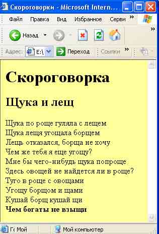

# Разметка. Контрольное задание

(X)HTML-документы могут быть созданы при помощи любого текстового редактора или специализированных HTML-редакторов и конвертеров. Выбор редактора, который будет использоваться для создания HTML-документов, зависит исключительно от понятия удобства и личных пристрастий каждого автора.

В заданиях для создания html документов вам предлагается использовать редактор [CodePen](https://codepen.io/) или [CodeSandbox](https://codesandbox.io/), но вы можете работать в любом удобном для вас редакторе.

-   С помощью редактора создайте страницу. Для этого:

1. Откройте редактор [CodePen](https://codepen.io/) или [CodeSandbox](https://codesandbox.io/);
2. Создайте проект, который при открытии в браузере будет выглядеть предложенным образом;
3. Сохраните проект, Primer_1.html(обратите внимание на расширение файла html). Для этого:
    1. вы должны быть авторизованы;
    2. убедиться в том, что проект могут просматривать все пользователи.
    3. нажмите save;
    4. скопируйте ссылку на сохранённый проект.
4. Отправить ссылку на проверку.

  

