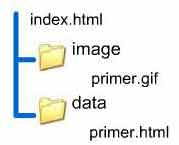
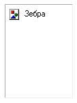
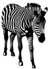
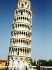
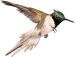

# Графические изображения

Графические изображения - одна из главных составляющих современных web-страниц, редкий сайт обходится без них. В XHTML для встривания графических изображений используется элемент **img**.

На web-страницах используются графические форматы: **gif**, **jpeg**, **png**.

Тег `img` , имеет обязательный атрибут **src**, который определяет адрес файла с картинкой.

```html

```

Закрывающий тег не требуется, поэтому не забывайте добавлять слеш в конце тега изображения, согласно спецификации xhtml.

`URI` представляет собой путь к графическому файлу. Для его указания можно использовать как абсолютный, так и относительный адрес.

Для примера возьмем файл с рисунком, который называется primer.gif и хранится в папке image корня сайта (Рис.1).

**Рис. 1. Иерархия папок**

<p align="center">
  
</p>

Ниже приведен код простых Web-страниц в которые добавлен графический рисунок.

**Пример 1. Внедрение изображения в файл index.html**

```html
<html>
	<body>
		 - при внедрении
		данного изображения использовался абсолютный адрес размещения файла с
		картинкой  - адрес - при внедрении данного
		изображения использовался адрес размещения картинки относительно текущей
		web-страницы.
	</body>
</html>
```

**Пример 2. Внедрение изображения в файл primer.html**

```html
<html>
	<body>
		 - адрес - при внедрении данного
		изображения использовался адрес размещения картинки относительно текущей
		web-страницы.
	</body>
</html>
```

Наиболее важные атрибуты элемента img:

<table border="1" cellpadding="5">
  <tbody><tr><td>Атрибут</td>	<td>Значения</td>	<td>Описание</td>	</tr>
  <tr><td>src</td>	<td>URI</td>	
  <td>URI графического файла, который должен быть встроен в документ.	</td>	</tr>
  <tr><td>alt	</td>	<td>текст</td>	
  <td>Задает текст, который будет выводиться на месте изображения в том случае, если  отключена загрузка изображений
  в браузере, в некоторых 
  браузерах при проведении мыши над изображением.	</td>	</tr>
  <tr><td>align</td>		<td>top<br>bottom<br>middle<br>left<br> right</td>	
  <td>Определяет выравнивание изображения
  на странице и указывает как текст должен его обтекать.

    </td>	</tr>

  <tr><td>border	</td>	<td>пиксели</td>	
  <td>ширина рамки вокруг изображения.	</td>	</tr>
  <tr><td>height, width</td>	<td>пиксели</td>	
  <td>высота, ширина изображения.	</td>	</tr>
  <tr><td>hspace, vspace	</td>	<td>пиксели</td>	
  <td>верхнее и нижнее, левое и правое поле изображения.	</td>	</tr>
  </tbody>
</table>

При внедрении изображений в web-документ помимо обязательного атрибута src рекомендуется также обязательно использовать атрибуты указывающие размеры изображения `width` , `height` и альтернативный текст `alt` .

### Альтернативный текст

Атрибут `alt` элемента `img` предназначен для отображения альтернативной текстовой информации об изображении.

Если в браузере отключена загрузка изображений, то с помощью этого атрибута отображается текстовая информация о картинке. Так как изображение загружается после того как браузером получена информация о нем, то альтернативный текст виден до тех пор, пока картинка не загрузится.

Некоторые браузеры также отображают альтернативный текст в виде всплывающей подсказки, появляющейся при наведении курсора мыши на изображение, но не все. Для всплывающей подсказки лучше использовать атрибут title.

**Пример 3. Альтернативный текст**

```html
<html>
	<body>
		<p>
			
			Зебра - белая с черными полосами, а не наоборот
		</p>
	</body>
</html>
```

**Если отключена загрузка изображений или неверно записан адрес картинки**

<p align="center">
  
  Зебра - белая с черными полосами, а не наоборот
</p>

**Вспылвающая подсказка title.**

<p align="center">
  
</p>

```html

```

Значение атрибута `alt` должно быть уместным и соответствовать специфики графического изображения. Например не следует указывать альтернативный текст для декоративных изображений, таких как горизонтальные и вертикальные линии. В таких случаях атрибуту `alt` необходимо присвовить пустое значение `alt=""` .

Использование атрибута alt считается признаком хорошего тона, так как это позволяет улучшить вывод и полезность документа.

### Ширина и высота изображения

Для того чтобы изменить высоту и ширину изображения необходимо воспользоваться соответственно атрибутами `height` и `width` .

В качестве значения используются пикселы, при этом аргументы должны совпадать с физическими размерами картинки. Если размеры изображения указаны явно, то браузер использует их для того, чтобы отображать соответствующую картинке пустую область в процессе загрузки документа. В противном случае браузер ждет, когда рисунок загрузится полностью, после чего меняет ширину и высоту картинки

Ширину и высоту изображения можно менять как в меньшую, так и большую сторону. Однако на скорость загрузки рисунка это никак не влияет, поскольку размер файла остается неизменным.

Для изменения размеров изображения следует изменять оба параметра - и высоту и ширину. Это необходимо для того чтобы сохранять правильные пропорции графического изображения. Увеличивать таким способом изображения нужно только в особых случаях, а то слишком ухудшается качество картинки. Для уменьшения веса изображения рекомендуется изменять его размеры с помощью графических редакторов.Следует помнить, что чем больше изображение, тем больше необходимо времени для загрузки этого изображения в броузер.

**Пример 5. Размеры изображения**

```html
<html>
	<body>
		
		- размеры данного изображения заданы в пикселях, соответствую физическим
		размерам.
		 -
		размеры данного изображения заданы в пикселях, меньше его физических
		размеров, но размер графического файла не изменился.
		
		- размеры данного изображения увеличены и увеличены не пропорционально,
		что сильно ухудшило качество.
	</body>
</html>
```

**Пример выполнения xhtml-кода**

 - размеры данного изображения заданы в пикселях, соответствую физическим размерам..

 - размеры данного изображения заданы в пикселях, меньше его физических размеров, но размер графического файла не изменился.

 - размеры данного изображения увеличены и увеличены не пропорционально, что сильно ухудшило качество.

### Выравнивание

Для изображений можно указывать их положение относительно текста или других изображений на веб-странице. Способ выравнивания изображений задается атрибутом align.

Значение bottom - выравнивание нижней границы изображения по окружающему тексту

**Пример выполнения xhtml-кода**

<p>
   Выравнивание нижней границы изображения по окружающему тексту
</p>

**Пример выполнения xhtml-кода**

<p>
   Выравнивание середины изображения по базовой линии текущей строки.
</p>

Значение top - верхняя граница изображения выравнивается по самому высокому элементу текущей строки.

**Пример выполнения xhtml-кода**

<p>
   Верхняя граница изображения выравнивается по самому высокому элементу текущей строки
</p>

Значение right - выравнивает изображение по правому краю окна.

**Пример выполнения xhtml-кода**

<p>
   Выравнивает изображение по правому краю окна.
</p>

<br>
<br>
<br>
<br>
<br>

Значение left - выравнивает изображение по левому краю.

**Пример выполнения xhtml-кода**

<p>
   Выравнивает изображение по правому краю окна.
</p>
<br>
<br>
<br>
<br>
<br>

Атрибуты left и right создают обтекание текста вокруг изображения

## Изображение в качестве ссылки

Наряду с использованием изображений в качестве иллюстраций к тексту или элементов оформления Web-страницы, в xhtml предусмотрена возможность использовать изображения в качестве гиперссылки.

Для того чтобы использовать графическое изображение в качестве ссылки на другой документ, необходимо воспользоваться элементом **a**. Элемент img помещается в элемент a. Для того, чтобы вокруг изображения не было синей рамки, установите значение атрибута border в 0.

**Пример 1**

```html
<html>
	<body>
		<p>
			<a href="images/kolibri.jpg" target="_blank">
				
			</a>
			При нажатии на изображение оно откроется в новом окне.
		</p>
	</body>
</html>
```

**Пример выполнения xhtml-кода**

<p>
<a target="_blank">
  
  </a>
  
  При нажатии на изображение, откроется новая вкладка
</p>

<p>

## Карта изображения

Отдельное графическое изображение можно использовать как ссылку, но более интересные возможности дают карты изображений, с помощью которых в качестве ссылки можно использовать фрагмент графического изображения.

**Карта изображения** - это графический рисунок, отдельные фрагменты которого используют для создания графических гиперссылок на различные ресурсы: web-страницы, файлы и другие изображения.

Карты изображений задаются элементом **map**, внутри этого элемента всегда содержится элемент **area** для задания фрагмента изображения.

У элемента map обязательно задается значение атрибута **name** (можно указать значение атрибута id с таким же значением).

Карта изображений связана с графическим изображением (элемент img), для связывания рисунка с картой используйте атрибут **usemap**, которому присваивается имя карты(значение атрибута name)с #.

```html

```

Для того чтобы организовать карту изображений, необходимо знать координаты той области рисунка, которую вы хотите сделать ссылкой. Эти координаты можно определить с помощью специальных программ: Image Ready, HomeSite и т.д.

Если нет специальной программы, то для определения координат можно использовать атрибут ismap элемента img, который указывает, что изображение используется как серверная карта изображений. Элемент img помещаем в элемент a, у которого значение атрибута href равно "#", устанавливаем атрибут ismap. Открываем документ в браузере, при наведении курсора мыши на картинку, в строке состояния, видны координаты.

```html
<a href="#">
	
</a>
```

Как было сказано выше, внутри map всегда элемент **area**, который задает выделяемую область. Обязательный атрибуты этого элемента: shape – форма, может принимать значения: rect(rectangle) - прямоугольник, circ(circle) - окружность, poly(polygon) - многоугольник.

Для каждой формы указываются соответствующие координаты с помощью атрибута **coords**.

Для прямоугольника указываются Координаты верхней левой и правой нижней точки: "x_left, y_top, x_right, y_bottom".
