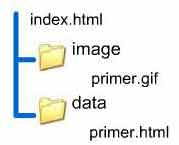
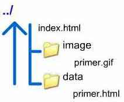
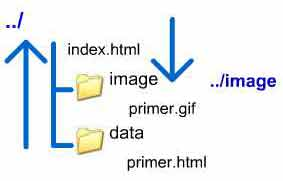

# Ссылки

Самое главное отличие web от других сред (прессы, тедлевидения, радио) это наличие гиперссылок. Гиперссылки - основа web, именно они обеспечивают перемещение от сайта к сайту

Гиперссылка - это фрагмент страницы (фрагмент текста, графическое изображение), с помощью которого осуществляется переход на другой интернет-ресурс.

Для создания ссылки необходимо сообщить браузеру, что является ссылкой. Для разметки ссылок предназначен элемент `a` .

Также необходимо указать адрес ресурса, на который следует сделать ссылку. Этот адрес называется универсальный идентификатор ресурса, или `URI` (Uniform Recource Identifier). Типичный URI выглядит следующим образом: `http://www.baikal.ru/index.html` , в нем говорится, что по протоколу HTTP с сервера, доменное имя которого www.baikal.ru надо получить файл index.html из корневого каталога. Для обозначения точки назначения используется обязательный атрибут href. Атрибут href, сокращение от "hypertext reference/гипертекстовая ссылка".

```html
<a href="URI объекта, на который необходимо сделать ссылку">
	содержание элемента
</a>
```

Содержанием элемента `<a>` может быть текст или изображение, то что посетитель страницы должен увидеть, а значением атрибута href - адрес объекта, на который посетитель должен перейти.

Адрес ссылки может быть абсолютным и относительным.

`Абсолютные адреса` работают везде и всюду независимо от имени сайта или веб-страницы, где прописана ссылка.

`Относительные ссылки` , как следует из их названия, построены относительно текущего документа или адреса.

Ссылки можно создавать не только на внешние ресурсы, но и внутри web-страницы.

Ссылки, определяемые элементом `a` , не могут быть вложенными; тег `<a>` не должен содержать других тегов `<a>` .

Наиболее важные атрибуты элемента a:

<table border="1" cellpadding="5">
<tbody>
<tr><td>Атрибут</td>	<td>Значения</td>	<td>Описание</td>	</tr>
<tr><td>href	</td>	<td>URI</td>	
<td>URI источника, на который указывает ссылка	</td>	</tr>
<tr><td>name	</td>	<td>уникальное имя</td>	
<td>Имя якоря. Используйте этот атрибут для создания меток в документе.	</td>	</tr>
<tr><td>target	</td>	<td>_blank (в новом окне)<br>_parent<br>_self<br>_top</td>	
<td>Указывает, где открывается документ	</td>	</tr>
<tr><td>title	</td>	<td>текст</td>	
<td>Дополнительная информация о документе	</td>	</tr>
</tbody>
</table>

## Абсолютные ссылки

Абсолютные адреса работают везде и всюду независимо от имени сайта или веб-страницы, где прописана ссылка, потому что указывается полный идентификатор ресурса. Начинаются они с указания протокола передачи данных. Так, для веб-страниц это обычно HTTP (HyperText Transfer Protocol, протокол передачи гипертекста), соответственно, абсолютные ссылки начинаются с ключевого слова **http://**. Затем идет доменное имя сервера и путь к файлу, который нужно открыть.

**Пример. 1. Абсолютные ссылки**

```html
<a href="http://www.isu.ru">
	Иркутский государственный университет
</a>
```

В браузере данная ссылка будет выглядеть следующим образом:

<a href="http://www.isu.ru">
    Иркутский государственный университет
</a>

В примере атрибут href имеет значение `http://www.isu.ru` , которое является полным адресом. Слова "Иркутский государственный педагогический университет" это текст, который показывается в браузере как ссылка.

Обязательно закрывайте тег `</a>` .

Кодовое слово, стоящее в начале URI в примерах обозначает так называемую схему доступа к различным службам Интернета.

Можно использовать гиперссылку для посылки писем по электронной почте. В этом случае значение href будет иметь вид: `mailto:адрес_электронной_почты` , например `mailto:k-pop@gmail.com` . Когда гиперссылка используется для указания адреса электронной почты её выбор обеспечивает не переход к новому документу, а запуск диалога для отправки сообщения указанному адресату. При использовании такой гиперссылки у клиента открывается почтовый клиент, настроенный на компьютере по умолчанию. Иногда такую ссылку размещают в конце страницы для обеспечения связи с Web-мастером или автором страницы.

**Пример. 2. Ссылка на электронный адрес**

```html
<a href="mailto:k-pop@gmail.com">
	Задать вопрос
</a>
```

В браузере данная ссылка будет выглядеть следующим образом:

<a href="mailto:k-pop@gmail.com">
    Задать вопрос
</a>

## Относительные ссылки

Относительные ссылки построены относительно текущего документа. Например, рассмотрим следующую иерархию папок (рис.1) на сервере, все документы нашего сайта располагаются в папке, например, project, внутри этой папки имеются две папки image для хранения графических изображений и data, для хранения документов. В корне располагается главная страница index.html

**Рис. 1. Иерархия папок**

<p align="center">
  
</p>

Тогда ссылки из `index.html` на документы в папках image и data будут иметь вид:

**Пример. 3.**

```html
<a href="data/primer.html"> Ссылка </a>

<a href="image/primer.gif"> Ссылка </a>
```

В адресе прописывается относительный путь, обратите внимание, что при написании пути мы используем слеш /, а не обратный слеш \ (используем при написании полного имени файла на локальном компьютере).

Теперь посмотрим как написать адрес документа, если он находится в иерархии папок на уровень выше(Рис.2).

**Рис. 2. Переход на уровень выше**

<p align="center">
  
</p>

Организуем ссылку из документа `primer.html` в папке data на `index.html` , переход на уровень вверх обозначается двумя точками, т.е. в нашем случае один переход на уровень вверх из папки data, слеш и имя файла. Ссылка будет выглядеть так:

**Пример. 4.**

```html
<a href="../index.html"> Ссылка </a>
```

Если бы нужно было перейти на два уровня вверх, то в адресе это выглядело бы так: ../../

Теперь рассмотрим ссылку из документа в папке data на ресурс в папке image.(Рис.3)

**Рис. 3. Из вложенной папки во вложенную папку**

<p align="center">
  
</p>

В данном случае, организуя путь, мы сначала поднимаемся на уровень вверх, что обозначается двумя точками, а затем переходим в папку image и указываем нужный документ. Сcылка будет выглядеть так:

**Пример. 5.**

```html
<a href="../image/primer.gif"> Ссылка </a>
```

## Ссылки внутри страницы

Кроме ссылок на другие ресурсы, с помощью xhtml можно создать ссылку на отдельный элемент (якорь) внутри одной Web-страницы. Это удобно, например, когда документ большой и есть оглавление со ссылками на соответствующие разделы.

Для создания ссылки следует вначале сделать метку (якорь). Это делается с помощью элемента `a` , но в этом случае используется атрибут `name` . Этот атрибут задает имя метки, как показано в примере 6.

**Пример. 6. Создание метки (якоря)**

```html
<a name="glava1">
	Линия перемены дат
</a>
— условная линия на поверхности земного шара, по разные стороны которой часы
показывают одно и то же время, но календарные даты различаются на одни сутки.
<br />
<a name="glava2">
	Учебный год
</a>
— период длительностью в один обычный (астрономический) год, начинающийся 1
сентября. Учебный год делится на 4 четверти в школе, на 2 семестра в ВУЗах и
ССУЗах. <br />
<a name="glava3">
	Интернет-время
</a>
— альтернативная система измерения времени, предложенная швейцарской часовой
компанией Swatch. Концепция интернет -времени базируется на том, что сутки
поделены на 1000 «битов» (beat, удар; не путать с битом, bit, в информатике),
каждый из которых длится 1 минуту и 26,4 секунды. Символ интернет-времени — @.
Таким образом, начало суток — 00:00:00 — обозначается @000, а конец суток —
23:59:59 — @999.
```

В браузере метки не видны.

Затем на созданный таким образом якорь с помощью того же тега `<a>` , но уже с атрибутом href можно с делаь однозначную ссылку. Для того чтобы отличить имя файла от имени якоря используется символ фунта - #.

**Пример. 7. Создание ссылки на якорь**

```html
<h1>«Измерение времени»</h1>
<p><a href="#glava1">Линия перемены дат </a></p>
<p><a href="#glava2">Учебный год </a></p>
<p><a href="#glava3">Интернет-время </a></p>

<a name="glava1">
	Линия перемены дат
</a>
— условная линия на поверхности земного шара, по разные стороны которой часы
показывают одно и то же время, но календарные даты различаются на одни сутки.
<br />
<a name="glava2">
	Учебный год
</a>
— период длительностью в один обычный (астрономический) год, начинающийся 1
сентября. Учебный год делится на 4 четверти в школе, на 2 семестра в ВУЗах и
ССУЗах. <br />
<a name="glava3">
	Интернет-время
</a>
— альтернативная система измерения времени, предложенная швейцарской часовой
компанией Swatch. Концепция интернет -времени базируется на том, что сутки
поделены на 1000 «битов» (beat, удар; не путать с битом, bit, в информатике),
каждый из которых длится 1 минуту и 26,4 секунды. Символ интернет-времени — @.
Таким образом, начало суток — 00:00:00 — обозначается @000, а конец суток —
23:59:59 — @999.
```

К именам якорей применяются следующие правила:

-   **Уникальность**: Имена якорей должны быть уникальны в пределах документа. Имена якорей в одном документе не могут отличаться только регистром.
-   **Соответствие строк**: Сравнение между идентификаторами фрагментов и именами якорей должно проводиться на основе полного (с учетом регистра) совпадения.

Следующий пример не является корректным в смысле уникальности, поскольку два имени отличаются только регистром:

**Пример 8. Недопустимое использование**

```html
<a name="red">...</a>; <a name="RED">...</a>;
```

Атрибут id может использоваться в начальном тэге любого элемента (включая элемент a).

Атрибуты id и name используют одно и то же пространство имен. Это означает, что они не могут принимать одинаковое значение у разных элементов в одном и том же документе, если атрибуты id и name используются у одного элемента, они должны принимать одинаковые значения.

Далее показан недопустимый фрагмент кода xhtml, поскольку эти атрибут объявляют одно и то же имя дважды в пределах одного документа.

**Пример 9. Недопустимое использование**

```html
<a href="#a1">Ссылка на якорь </a>
...
<h1 id="a1">Заголовок</h1>
...текст...
<a name="a1"> якорь</a>;
```

Для того чтобы создать ссылку на якорь в другом документе, то сначала следует указать относительный или абсолютный адрес страницы, а затем # и имя якоря.

**Пример 10. Ссылка на якорь другой веб-страницы**

```html
<a href="start.html#glava1">
	Ссылка на якорь другой страницы
</a>
```
