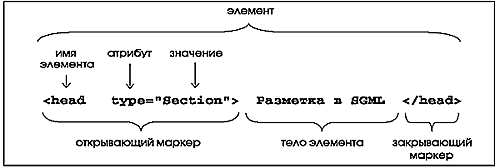

# Языки разметки

Большую часть информации человек хранит в виде документов. Сосавляющие документа:

-   cодежание(смысловое наполнение);
-   структура;
-   внешнее представление.

Структура документа позволяет правильно определить составляющие его части и взаимодействие между ними.

Внешнее представление направлено на повышение эффективности восприятия читателем.

Следовательно, в документе помимо смыслового наполнения должна содержаться информация о документе(мета информация), позволяющая определить его структуру и внешнее представление - такая информация и называется **разметкой документа**.

Основные цели разметки:

-   выделение логических элементов документа и связей между ними;
-   определение действий, которые осуществляются с элементами.

## Структурная(логическая) разметка

Каждый структурированный документ состоит из некоторого набора смысловых элементов, связанных друг с другом по определенным правилам.

Язык разметки должен определять ряд специальных инструкций, правил и соглашений для описания структуры элементов документа и отношений между элементами этой структуры.

Основным компонентом структурированного текста является элемент, например, таблица, абзац, список и т.д.

Пример структурной(логической разметки):

```html
	<div1 type="glava">

	    <head>Введение

	        <head>
	            <p> Так уж сложилось, что большую часть информации
	                человек предпочитает хранить в виде документов...
	            <p>
	</div1>
```

В примере выделено три элемента: глава документа, в главе документа заголовок (Введение) и абзац(Так уж сложилось, что большую часть информации человек предпочитает хранить в виде документов...).

Основным компонентом структурированного текста является элемент.

Каждый структурированный документ состоит из некоторого набора смысловых(семантических) элементов, связанных друг с другом по определенным правилам.

Синтаксическое представление элемента:

<p align="center">
  
</p>

Размеченный документ предназначен для дальнейшей обработки различными программами, каждая из которых может применять свои правила обработки к тем или иным элементам документа. Мы с вами будем изучать язык разметки гипертекста (HTML) с помощью которого создают документы для web ресурсов Интернета. HTML-документ предназначен для обработки браузером. **Браузер(browser)** - специальные программы для просмотра гипертекстовых документов. Среди наиболее популярных можно назвать Mozilla FireFox, Internet Explorer, Opera.

Язык **HTML** ( HyperText Markup Language) — язык разметки гипертекста, набор управляющих команд, соответствующих определенному стандарту и интерпретируюмых браузером в ходе отображения web-страницы на экран монитора.

Такие языки разметки, как HTML, XML и многие другие созданы на основе SGML. SGML(Standard Generalized Markup Language) - обобщенный язык разметки был утвержден организацией по стандартизации(International Standards Organisation, ISO) в качестве стандарта в 1986 году.

Разметка определяемая в рамках SGML, основывается на двух постулатах:

-   разметка должна описывать структуру документа, а не указывать, что с документом или его частями долно происходить;
-   разметка должна быть строгой.

HTML – универсальный и платформонезависимый язык, родился в Лаборатории физики высоких энергий (CERN) в Женеве в 1990 году . HTML состоял из небольшого фиксированного набора элементов – заголовков нескольких уровней, абзацев, списков и т.д.

Главной особенностью гипертекста стала возможностью связывать отдельные страницы гиперссылками, по принципу «нелинейного» структурирования материала, позволяющих одним щелчком мыши перемещаться из одной "смысловой точки" гипертекстового документа в другую.

Но, к сожалению, HTML имеет ряд недостатков:

-   Отсутствие жесткой иерархии элементов.
-   Не всякая метаинформация может быть простым и корректным образом вставлена в документ.
-   Для некоторых областей деятельности HTML не предоставляет возможностей ни структурно размечать требуемые элементы, ни правильным образом выводить их на экран или принтер. (математика, химия)...

_XML_ (eXtensible Markup Language ) - последний и наиболее «гибкий» язык разметки;

XML является метаязыком, т.е. языком для создания новых языков структурной разметки.

_XHTML_ (eXtensible HyperText Markup Language ), промежуточный шаг от HTML к XML(eXtensible Markup Language). XHTML - последняя и более структурированная версия языка HTML, этот язык мы и будем изучать.

Отличие HTML от XHTML:

-   новые атрибуты у элемента html;
-   все теги должны быть набраны строчными буквами;
-   обязательно присутствуют закрывающий и открывающий тег для каждого элемента, у пустых элементов обязательно /;
-   значения атрибутов обязательно помещаются в кавычки.

## Разметка представления

Структурная разметка не предназначена для обеспечения удобочитаемости документов. Для этого существует разметка представления.

Пример разметки представления:

```html
<font face="Arial" size="16"
	>Введение
	<font face="Times New Roman" size="12">
		Так уж сложилось, что большую часть информации человек предпочитает
		хранить в виде документов...</font
	>
</font>
```

В этом примере с помощью команд указывается шрифт и размер текта.

Мы с вами в дальнейшем будем изучать технологию **CSS(каскадные таблицы стилей)**, с помощью которой задается как тот или иной элемент отображается на экране монитора в браузере. Эта технология служит для разделения дизайна документа и его логической структуры.

## Язык (X)HTML

Язык разметки гипертекста состоит из :

-   **элементов** - главная структурная единица языка.
-   **атрибутов(свойств элементов)**, которые принадлежат элементам и могут принимать различные значения, один элемент может иметь несколько атрибутов.

Элементы задаются с помощью тегов.

Тег - набор символов, изадающий структурную единицу документа и указывающий браузеру способ отображения этого элемента.

Тег состоит из элемента и атрибута в угловых скобках. Большинство тегов требуют наличия закрывающих тегов, закрывающий строится из названия элемента, перед которым ставится /, такие теги еще называют контейнерами. Атрибуты помещаются только в открывающий тег, атрибутов может быть несколько.

```html
<имя_элемента имя_атрибута1="значение1" имя_атрибута2="значение">
    содержание элемента
</имя_элемента>
```

**Пример 1. Задание абзаца в документе**

```html
...
<p>Текст</p>
...
```

Поскольку одновременно можно использовать любое разумное сочетание тегов, следует помнить об их вложенности (пример 2). Один тег(контейнер) должен находиться внутри другого, и никак не пересекаться (пример 3).

**Пример 2. Правильное сочетание тегов**

```html
...
<div>
	<p>Один блок(p) находится внутри другого блока(div)</p>
</div>
...
```

**Пример 3. Неправильное сочетание тегов**

```html
...
<div>
    <p>Неправильное сочетание тегов
</div>
</p>
...
```

В примере 3 нарушена вложенность тегов один в другой. Хотя браузер и отобразит пример корректно, подобных ошибок следует избегать.

**Пример 4. Атрибуты элемента**

```html
...
<p align="center" title="Пример">
	Текст будет выровнен по центру, а при наведении курсора мыши на абзац,
	появится заголовок.
</p>
; ...
```

В примере 4 приведен пример использования атрибутов элементов.

Есть еще, так называемые, "пустые" элементы.

```html
<имя_элемента имя_атрибута1="значение1" имя_атрибута2="значение" />
```

**Пример 5. Пустой элемент**

```html
... Переход на новую строку <br />
Горизонтальная линия
<hr />
...
```
