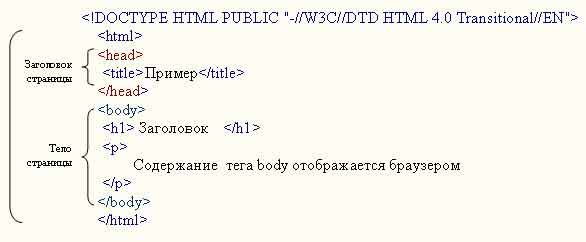

# Структура web-страницы

В глобальном плане код Web-страницы можно разбить на следующие части:

-   Строка которая указывает браузеру какая версия и спецификация (X)HTML используется в документе. Для указания спецификации используется тег <! DOCTYPE>, возможен один из трех типов документов Strict, Transitional или Frameset. Более внимательно рассмотрим вопрос указания типа документа и версии языка в следующих уроках.
-   Затем начинается сам html-документ, который состоит из:
    -   описательной секции (head);
    -   тела документа (body).

**Пример 1. Структура Web-страницы**

<p align="center">
  
</p>

Код каждого html-документа должен начинаться с открывающего тега `<html>` и заканчиваться соответствующим закрывающим тегом `</html>` . Кроме этого, в код любого html-документа должны быть включены, как было сказано выше элементы head и body, :

-   Элемент head (задается тегами `<head>` и `</head>`) необходим для хранения информации о самом документе, то, что хранится в этом элементе, в окне браузера не отображается;
-   между тегами `<body>` и `</body>` располагается содержимое документа, которое отображается в окне браузера.

В примере 1 используются элементы заголовок первого уровня **h1** и абзац **p**.

## Раздел заголовка документа (head)

Этот раздел обычно предназначен для хранения информации о документе.

**Заголовок страницы (элемент title)**
Используется для отображения строки текста в строке заголовка (в левом верхнем углу окна браузера). Mежду тегами <title> и </title> вводят титульные данные. Такая строка сообщает пользователю название сайта и другую информацию, которую добавляет разработчик.

**css (Cascading Style Sheets, Каскадные таблицы стилей)**
Стили хранят набор элементов форматирования, который применяется к тексту документа, чтобы быстро изменить его внешний вид.

**Мета информация (элементmeta)**
Метатеги используются для хранения информации предназначенной для браузеров и поисковых систем. В этом теге можно помещать ключевые слова, информацию об авторе и другие данных. Хотя тег <meta> всего один, он имеет множество параметров, поэтому для его обращения применяется множественное число. Например в этом теге нужно указывать кодировку кириллицы, если ваша страница на русском языке

```html
<meta http-equiv="content-type" content="text/html; charset=windows-1251" />
```

**Скрипты**

Скриптом традиционно называют программу, которая внедряется в тело веб-страницы и выполняет на ней определенные действия. Распространенным языком программирования для написания скриптов является JavaScript.

Порядок тегов в заголовке документа особого значения не имеет.

## Тело документа (body)

Тело документа предназначено для отображения данных на веб-странице, в частности, в теле размещается текст, изображения, ссылки, таблицы, списки и т.д.

Все атрибуты представления элемента считаются нерекомендованными :

| Атрибут    | Значения             | Описание                                                                                                     |
| ---------- | -------------------- | ------------------------------------------------------------------------------------------------------------ |
| alink      | rgb(x, x, x) #xxxxxx | название_цвета Задает цвет активной ссылки в документе. Нерекомендованный. Лучше используйте таблицу стилей. |
| background | имя_файла Задает     | фоновый рисунок. Нерекомендованный. Лучше использовать таблицу стилей...                                     |
| bgcolor    | rgb(x, x, x) #xxxxxx | название_цвета Задает цвет фона. Нерекомендованный. Лучше использовать таблицу стилей.                       |
| link       | rgb(x, x, x) #xxxxxx | название_цвета Задает цвет ссылок. Нерекомендованный. Лучше использовать таблицу стилей.                     |
| text       | rgb(x, x, x) #xxxxxx | название_цвета Задает цвет текста в документе. Нерекомендованный. Лучше использовать таблицу стилей.         |
| vlink      | rgb(x, x, x) #xxxxxx | название_цвета Задает цвет посещенных ссылок. Нерекомендованный. Лучше использовать таблицу стилей.          |

## Основные теги

Теги от `<h1>` до `<h6>` определяют заголовки, `<h1>` определяет самый большой заголовок, `<h6>` - самый маленький. Атрибут align может принимать значения: left, center, right, justify. Определяет выравнивание заголовка. Нерекомендованный. Лучше использовать таблицу стилей.

Тег `<p>` определяет абзац.

Тег `<br />` вставляет принудительный перевод cтроки. Желательно использовать `<br>` для ввода пустой строки, а не для организации абзаца.

Тег `<hr />` вставляет горизонтальную линию.

Атрибут align может принимать значения: left, center, right, justify. Определяет выравнивание.

Атрибут size может принимать значения в пикселях или в процентах. Этот атрибут задает толщину горизонтальной линии.

Атрибут width может принимать значения в пикселях или в процентах, задает ширину горизонтальной линии.

Все эти атрибуты считаются нерекомендованный. Желательно использовать таблицу стилей.

Тег `<!--...-->` вставляет комментарии в исходный код. Комментарий игнорируется браузером и не виден для пользователя. Комментарии помогают работать с исходным кодом в дальнейшем. Так же комментарий позволяет хранить специальную информацию.
